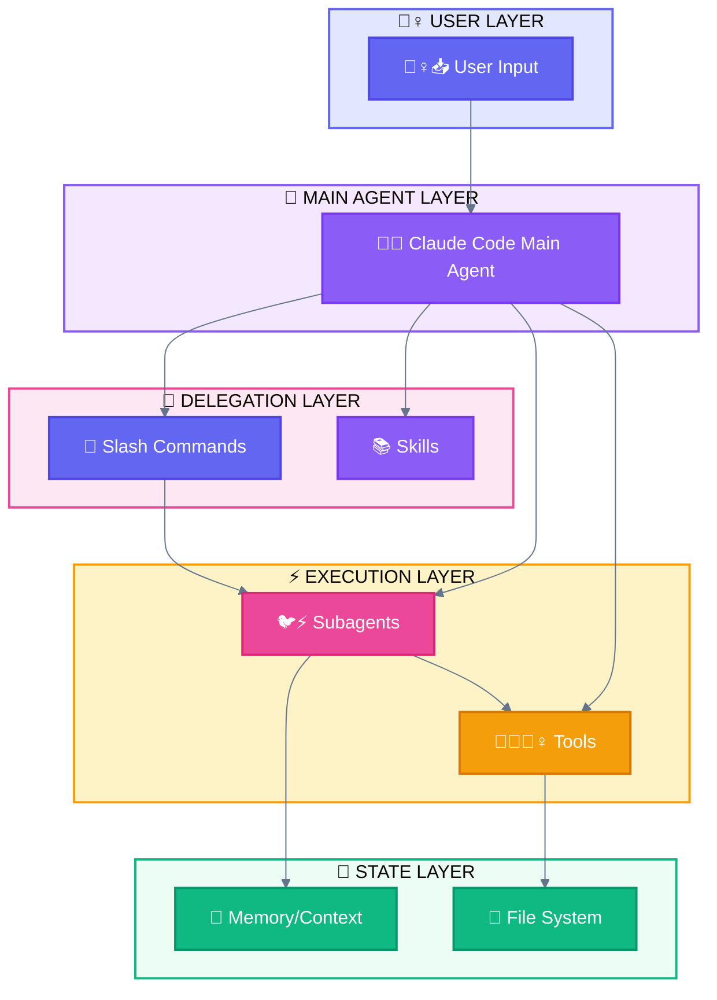
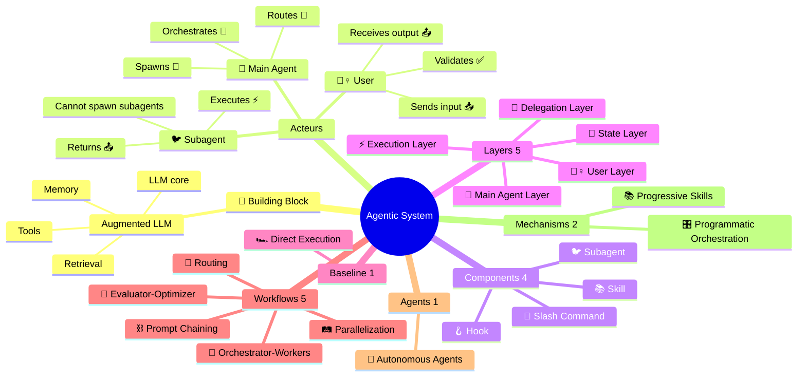

<div align="center">

[🏠 Home](README.md) • **00 Overview**

━━━━━━●━━━━━━━━━━━━━━━━━━━━━━━━━ `0/8`

[01 Terminology →](01-OFFICIAL-TERMINOLOGY.md)

</div>

---

# Claude Code Agentic Systems - Documentation

> Complete reference for understanding and implementing agentic workflows & agents with Claude Code CLI

## 📑 Table of Contents

| # | Section | Description |
|---|---------|-------------|
| 1 | [Quick Navigation](#quick-navigation) | Links to all documents |
| 2 | [Emoji Quick Reference](#emoji-quick-reference) | Visual legend |
| 3 | [Anthropic Taxonomy](#anthropic-taxonomy) | 🧱 Building Block + Workflows + Agents |
| 4 | [At a Glance](#at-a-glance-key-concepts) | Components & Layers |
| 5 | [How to Read](#how-to-read-this-documentation) | Reading paths |
| 6 | [Cross-Platform](#cross-platform-compatibility) | Compatibility matrix |

---

## Quick Navigation

| Document | Content |
|----------|---------|
| [01-TERMINOLOGY](01-OFFICIAL-TERMINOLOGY.md) | Claude Code components (Subagent, Command, Skill, Hook) |
| [02-ARCHITECTURE](02-LAYER-ARCHITECTURE.md) | 5-Layer system architecture |
| [03-WORKFLOWS](03-WORKFLOWS.md) | Baseline + 5 Workflows + variants + mechanisms |
| [04-AGENTS](04-AGENTS.md) | Autonomous Agents + Multi-Window Context |
| [05-USE-CASES](05-USE-CASES.md) | **Real-world validated use cases** |
| [06-SELECTION-GUIDE](06-SELECTION-GUIDE.md) | Decision tree for choosing systems |
| [07-GLOSSARY](07-MAPPING-GLOSSARY.md) | Cross-reference and definitions |

---

## Emoji Quick Reference

```
┌─────────────────────────────────────────────────────────────────────────────┐
│                           EMOJI QUICK REFERENCE                             │
├─────────────────────────────────────────────────────────────────────────────┤
│                                                                             │
│  ACTEURS                             CLAUDE CODE PATTERNS                   │
│  ───────                             ────────────────────                   │
│  🙆‍♀️ User (neutral)                  🏎️ Direct Execution                    │
│  🙋‍♀️ User (input)                    🦑 Subagent Orchestration              │
│  💁‍♀️ User (output)                   🚂 Parallel Tool Calling               │
│  🐔 Main Agent                       🧬 Master-Clone                        │
│  🐦 Subagent                         🧙 Wizard Workflow                     │
│                                      🖥️ Multi-Window Context                │
│  COMPONENTS                          MECHANISMS                             │
│  ──────────                          ──────────                             │
│  🦴 Slash Command                    📚 Progressive Skills                  │
│  📚 Skill                            🎛️ Programmatic Orchestration          │
│  🪝 Hook                                                                    │
│  💾 State                            PATTERN VARIANTS                       │
│  ❓ AskUserQuestion                  ────────────────                       │
│                                      🧙 Wizard Workflow                     │
│  TOOLS                               🚂 Parallel Tool Calling               │
│  ─────                               🧬 Master-Clone                        │
│  🔧 Built-in                         🖥️ Multi-Window Context                │
│  🔌 External (MCP)                                                          │
│                                      STATUS                                 │
│  💁‍♀️ User Interaction                ──────                                 │
│                                      ✅ Success    ❌ Error                 │
│  PHASES                              ⚠️ Warning    🔄 Progress              │
│  ──────                              ⏳ Pending    ⏭️ Skip                  │
│  🏗️ Phase 1 (Foundation)                                                   │
│  🔗 Phase 2 (Formatting)                                                    │
│  📝 Phase 3 (Content)                                                       │
│  🔮 Phase 4 (Synthesis)                                                     │
│                                                                             │
└─────────────────────────────────────────────────────────────────────────────┘
```

---

## Anthropic Taxonomy

> Source: [Building Effective Agents](https://www.anthropic.com/engineering/building-effective-agents) (Dec 2024)

### 🧱 Building Block: Augmented LLM

The foundation of ALL agentic systems. Not to be confused with our Components.

```
┌─────────────────────────────────────────────────────────────────────────────┐
│                    🧱 BUILDING BLOCK = AUGMENTED LLM                         │
│                       (foundation for ALL patterns)                          │
├───────────────┬───────────────┬───────────────┬─────────────────────────────┤
│   Retrieval   │    Tools      │    Memory     │            LLM              │
│   (RAG/docs)  │   (actions)   │   (context)   │           (core)            │
└───────────────┴───────────────┴───────────────┴─────────────────────────────┘
```

> **⚠️ Important Distinction:**
> - **🧱 Building Block** = Augmented LLM (Anthropic's foundation concept)
> - **Components** = Claude Code abstractions (🐦 Subagent, 🦴 Slash Command, 📚 Skill, 🪝 Hook)
> - **Layers** = Our architectural organization (User → Main Agent → Delegation → Execution → State)

### Agentic Systems Hierarchy

> **Agentic Systems** = Umbrella term for any system using LLMs with tools and control flow.
> Encompasses **Baseline** (simple), **Workflows** (predefined), and **Agents** (dynamic).

```
┌─────────────────────────────────────────────────────────────────────────────┐
│                         AGENTIC SYSTEMS (umbrella)                           │
│─────────────────────────────────────────────────────────────────────────────│
│                    🧱 BUILDING BLOCK → WORKFLOWS → AGENTS                    │
├─────────────────────────────────────────────────────────────────────────────┤
│                                                                             │
│  Anthropic's progression: First the Augmented LLM block, then workflows     │
│  composed of these blocks, then agents that reuse blocks in loops with      │
│  real-world feedback.                                                       │
│                                                                             │
│  BASELINE (1)                    WORKFLOWS (5)          AGENTS (1)          │
│  ────────────                    ─────────────          ──────────          │
│  0. 🏎️ Direct Execution         1. ⛓️ Prompt Chaining  6. 🐉 Autonomous    │
│     (single augmented LLM)      2. 🚦 Routing                               │
│                                  3. 🛤️ Parallelization                      │
│                                  4. 🦑 Orchestrator-Workers                 │
│                                  5. 🩻 Evaluator-Optimizer                  │
│                                                                             │
│  CODE controls the flow ─────────────────────► LLM controls the flow        │
│                                                                             │
├─────────────────────────────────────────────────────────────────────────────┤
│  CLAUDE CODE COMPONENTS (4)               MECHANISMS                        │
│  ──────────────────────────               ──────────                        │
│  🐦 Subagent │ 🦴 Slash Command           📚 Progressive Skills (→ 🚦)      │
│  📚 Skill    │ 🪝 Hook                    🎛️ Programmatic Orchestration     │
└─────────────────────────────────────────────────────────────────────────────┘
```

---

## At a Glance: Key Concepts

### Components (What you build)

| Component | Emoji | Definition | File Location |
|-----------|-------|------------|---------------|
| **Subagent** | 🐦 | Specialized agent spawned via `Task` tool | `.claude/agents/*.md` |
| **Slash Command** | 🦴 | User-invokable command starting with `/` | `.claude/commands/*.md` |
| **Skill** | 📚 | Reusable capability the agent possesses | `.claude/skills/*/SKILL.md` |
| **Hook** | 🪝 | Shell command triggered by events | `.claude/settings.json` |

### Layers (How they interact)



### Critical Rule

> **🐦 Subagents cannot spawn other subagents.**
>
> All delegation must go through the 🐔 Main Agent.

---

## How to Read This Documentation

### If you're new to agentic systems:
1. Start with [01-TERMINOLOGY](01-OFFICIAL-TERMINOLOGY.md)
2. Then [02-ARCHITECTURE](02-LAYER-ARCHITECTURE.md)
3. Finally explore workflows/agents as needed

### If you're choosing a workflow:
1. Check [05-USE-CASES](05-USE-CASES.md) for real-world examples
2. Use [06-SELECTION-GUIDE](06-SELECTION-GUIDE.md) for decision trees

### If you're implementing:
1. Check [03-WORKFLOWS](03-WORKFLOWS.md) or [04-AGENTS](04-AGENTS.md) for implementation details
2. Use [07-GLOSSARY](07-MAPPING-GLOSSARY.md) for term lookups

---

## Relationship Map



---

## Cross-Platform Compatibility

These workflows/agents originate from Claude/Anthropic but many apply across AI frameworks:

| System | Claude | GPT Agents | Gemini ADK | LangGraph |
|:-------|:------:|:----------:|:----------:|:---------:|
| 🦑 Orchestrator-Workers | ✅ | ✅ Handoffs | ✅ Multi-agent | ✅ Subgraphs |
| 📚 Progressive Skills | ✅ | ❌ | ❌ | ❌ |
| 🚂 Parallel Tool Calling | ✅ | ✅ | ✅ ParallelAgent | ✅ Fan-out |
| 🧬 Master-Clone | ✅ | ✅ Dynamic | ✅ Custom | ✅ Send API |
| 🖥️ Multi-Window Context | ✅ | ⚠️ Sessions | ⚠️ ctx.state | ✅ Checkpointing |
| 🎛️ Programmatic Orchestration | ✅ | ✅ | ✅ Workflows | ✅ StateGraph |
| 🧙 Wizard Workflows | ✅ | ⚠️ | ✅ Tool Confirm | ✅ interrupt() |

**Legend:** ✅ Native | ⚠️ Partial | ❌ Not supported

> **Note**: 📚 Progressive Skills uses Claude Code's unique `.md`-based skill system. Other frameworks have "tools" but not this mechanism.

---

## Version & Sources

| Source | Version/Date | URL |
|--------|--------------|-----|
| Claude Code Docs | 2025 | https://docs.anthropic.com/en/docs/claude-code |
| Building Effective Agents | Dec 2024 | Anthropic Research Paper |
| Anthropic Cookbook | 2025 | https://github.com/anthropics/anthropic-cookbook |

---

<div align="center">

**━━━━━━━━━━━━━━━━━━━━━━━━━━━━━━━━━━━━━━━━━━━━━━━━**

[🏠 Home](README.md) • [01 Terminology →](01-OFFICIAL-TERMINOLOGY.md)

*Last updated: 2025-11-27*

</div>
