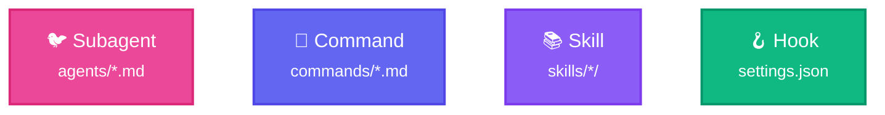
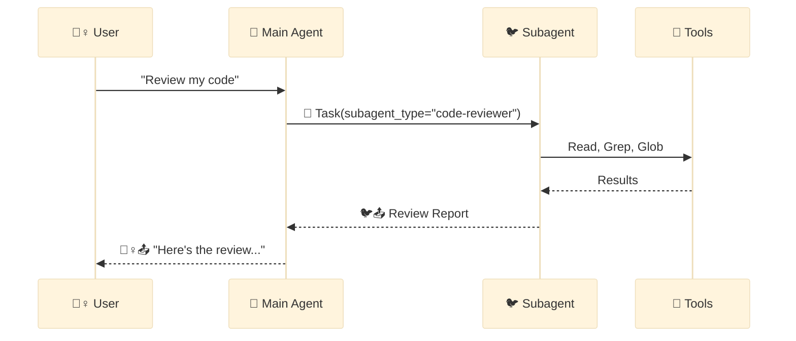
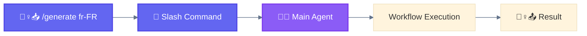
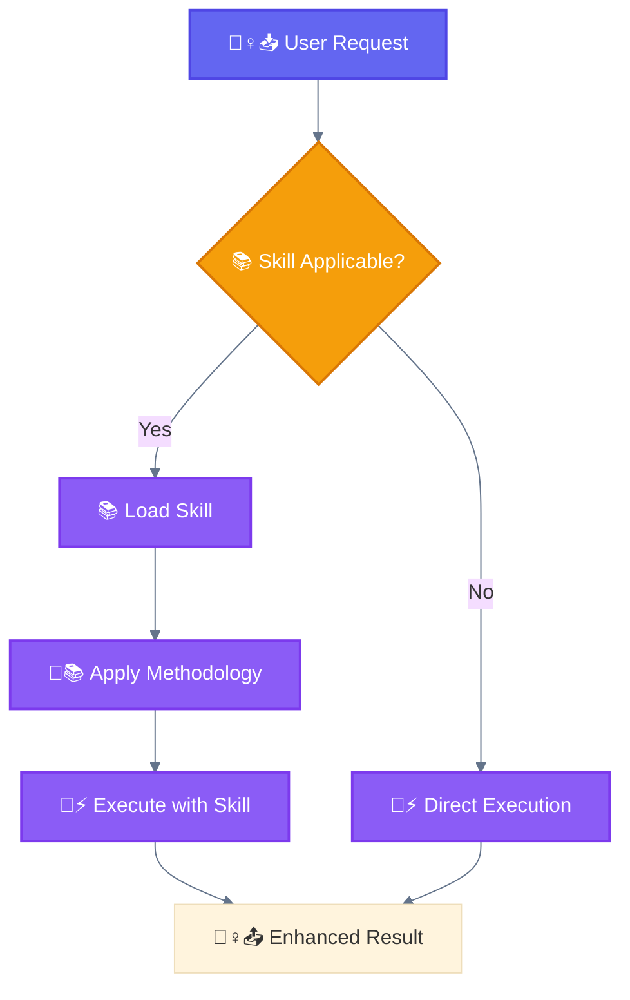
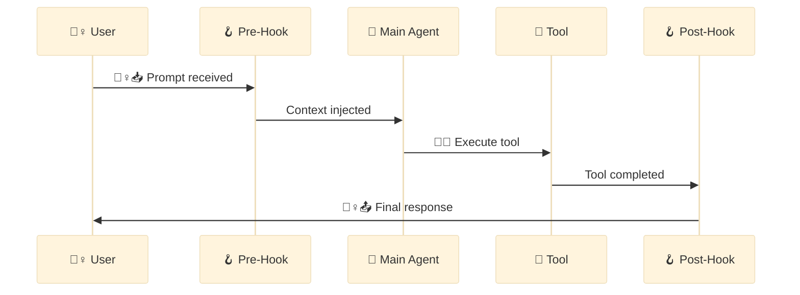
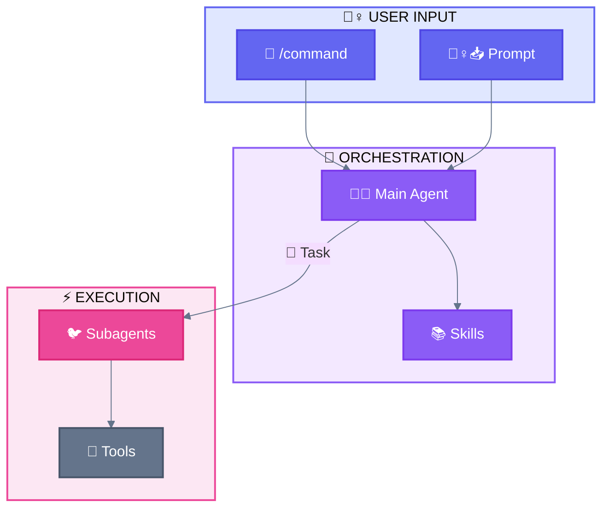

<div align="center">

[🏠 Home](README.md) • [📖 Overview](00-OVERVIEW.md) • **01 Terminology**

━━━━━━━●━━━━━━━━━━━━━━━━━━━━━━━ `1/8`

[← 00 Overview](00-OVERVIEW.md) • [02 Architecture →](02-LAYER-ARCHITECTURE.md)

</div>

---

# Official Claude Code Terminology

> Definitive reference for Claude Code terminology, patterns, and visual standards

---

## 📑 Table of Contents

<table>
<tr>
<td width="50%" valign="top">

### 🏗️ Foundations

| Section | Jump |
|---------|------|
| **0. 🧱 Building Block** | [→ Go](#0--building-block-vs-components) |
| **1. Core Components** | [→ Go](#1-core-components) |
| ↳ 1.1 🐦 Subagent | [→](#11--subagent) |
| ↳ 1.2 🦴 Slash Command | [→](#12--slash-command) |
| ↳ 1.3 📚 Skill | [→](#13--skill) |
| ↳ 1.4 🪝 Hook | [→](#14--hook) |
| **2. Agentic Systems** | [→ Go](#2-agentic-systems) |
| ↳ Baseline + Workflows | [→](#21-baseline-1--workflows-5--predefined-code-paths) |
| ↳ Workflow Variants | [→](#23-workflow-variants) |
| ↳ Mechanisms | [→](#24-implementation-mechanisms) |

</td>
<td width="50%" valign="top">

### 🎨 Visual System

| Section | Jump |
|---------|------|
| **3. ACTEUR + ACTION** | [→ Go](#3-acteur--action-system) |
| ↳ Acteurs (WHO) | [→](#31-acteurs-who) |
| ↳ Actions (WHAT) | [→](#32-actions-what) |
| **4. Tools** | [→ Go](#4-tools) |
| **5. Status & Triggers** | [→ Go](#5-status--triggers) |
| **6. Visual Standards** | [→ Go](#6-visual-standards) |
| **7. Naming Conventions** | [→ Go](#7-naming-conventions) |
| **8. Quick Reference** | [→ Go](#8-quick-reference) |

</td>
</tr>
</table>

---

<br/>

<!-- ═══════════════════════════════════════════════════════════════════════════
     PART 1: FOUNDATIONS
     ═══════════════════════════════════════════════════════════════════════════ -->

<div align="center">

# PART 1: FOUNDATIONS

*🧱 Building Block, Components, and Patterns*

</div>

<br/>

---

## 0. 🧱 Building Block vs Components

[📑 Back to TOC](#-table-of-contents)

> **⚠️ Important Distinction** — Don't confuse these terms!

```mermaid
%%{init: {'theme': 'base', 'themeVariables': {'lineColor': '#64748b'}}}%%
flowchart LR
    classDef block fill:#8b5cf6,stroke:#7c3aed,stroke-width:2px,color:#ffffff
    classDef comp fill:#6366f1,stroke:#4f46e5,stroke-width:2px,color:#ffffff
    classDef vs fill:#f59e0b,stroke:#d97706,stroke-width:3px,color:#ffffff

    subgraph LEFT["🧱 BUILDING BLOCK"]
        direction TB
        L1["Anthropic's foundation"]
        L2["AUGMENTED LLM"]:::block
        L3["RAG + Tools + Memory + LLM"]
        L4["→ Builds workflows & agents"]
    end

    VS(("≠")):::vs

    subgraph RIGHT["COMPONENTS"]
        direction TB
        R1["Claude Code abstractions"]
        R2["🐦 🦴 📚 🪝"]:::comp
        R3["Subagent • Command • Skill • Hook"]
        R4["→ Organizes agent capabilities"]
    end

    LEFT --- VS --- RIGHT

    style LEFT fill:#f5f3ff,stroke:#8b5cf6,stroke-width:2px
    style RIGHT fill:#eef2ff,stroke:#6366f1,stroke-width:2px
```



> **Key insight:** Each Claude Code Component internally uses the 🧱 Building Block (Augmented LLM) to function.

| Term | Source | What it is | Examples |
|------|--------|------------|----------|
| **🧱 Building Block** | Anthropic | Augmented LLM (LLM + retrieval + tools + memory) | Single LLM call with tool access |
| **Components** | Claude Code | Abstractions to organize agent capabilities | 🐦 Subagent, 🦴 Command, 📚 Skill, 🪝 Hook |
| **Layers** | This doc | Architectural organization | User → Main Agent → Delegation → Execution → State |

---

## 1. Core Components

[📑 Back to TOC](#-table-of-contents)



| Component | Invocation | Purpose |
|-----------|------------|---------|
| **🐦 Subagent** | Task tool (🪺) | Autonomous execution |
| **🦴 Slash Command** | `/command` | User-invoked workflows |
| **📚 Skill** | Context-based | Reusable patterns |
| **🪝 Hook** | Event-driven | Automated triggers |

<br/>

### 1.1 🐦 Subagent

#### Definition

A **Subagent** is an autonomous agent spawned by the 🐔 Main Agent via the `Task` tool (🪺 spawn action) to handle specific, isolated tasks.

#### Key Characteristics

| Property | Value |
|----------|-------|
| **Invocation** | `Task` tool with `subagent_type` parameter (🪺 spawn) |
| **Location** | `.claude/agents/*.md` |
| **Autonomy** | Full - executes independently |
| **Spawning** | ❌ Cannot spawn other subagents |
| **Context** | Isolated from main conversation |
| **Permissions** | Controlled via `permissionMode` frontmatter |

#### File Structure

```markdown
# .claude/agents/code-reviewer.md

---
name: code-reviewer
description: Reviews code for quality, security, and best practices
tools: Read, Write, Grep, Glob
model: sonnet
permissionMode: acceptEdits
skills: test-driven-development, code-review
---

You are a code review specialist. Your task is to...
```

> **Note**: `tools` and `skills` are comma-separated strings, not YAML lists.

#### Frontmatter Reference

| Field | Required | Description |
|-------|----------|-------------|
| `name` | Yes | Unique identifier (lowercase, hyphens) |
| `description` | Yes | Natural language description for discovery |
| `tools` | No | Comma-separated tool list. Omit to inherit all tools |
| `model` | No | `sonnet`, `opus`, `haiku`, or `inherit` (default: configured subagent model) |
| `permissionMode` | No | Controls permission handling (see below) |
| `skills` | No | Comma-separated skill names to auto-load |

#### Permission Modes

| Mode | Behavior | Use Case |
|------|----------|----------|
| `default` | Asks permission for each tool | Read-only, validation |
| `acceptEdits` | Auto-approves Write/Edit | Generation after 🧙 user confirmation |
| `bypassPermissions` | All tools auto-approved | Trusted autonomous workflows |
| `plan` | Read-only planning mode | Research without modifications |
| `ignore` | Skip permission prompts entirely | Batch processing |

> **Best Practice**: Use `acceptEdits` after 🧙 Wizard confirmation to enable autonomous generation without repeated permission prompts.

#### Usage Example

```python
# 🐔 Main Agent 🪺 spawns 🐦 subagent via Task tool
Task(
    subagent_type="code-reviewer",
    prompt="Review the authentication module for security issues"
)
```

#### Mermaid Representation



#### Built-in Subagents

| Subagent | Model | Tools | Purpose |
|----------|-------|-------|---------|
| **General-purpose** | Sonnet | All tools | Complex multi-step tasks |
| **Plan** | Sonnet | Read, Glob, Grep, Bash | Research (read-only) |
| **Explore** | Haiku | Glob, Grep, Read, Bash | Fast codebase searching |

**Explore Thoroughness:** `quick` → `medium` → `very thorough`

#### Resumable Subagents

```python
# Initial invocation returns agentId
Task(subagent_type="code-analyzer", prompt="Review auth module")
# Returns: agentId = "abc123"

# Resume with previous context
Task(
    subagent_type="code-analyzer",
    prompt="Now analyze authorization logic",
    resume="abc123"
)
```

[↑ Back to Section 1](#1-core-components)

<br/>

### 1.2 🦴 Slash Command

#### Definition

A **Slash Command** is a user-invokable workflow that starts with `/` and triggers predefined prompt sequences.

#### Key Characteristics

| Property | Value |
|----------|-------|
| **Invocation** | 🙋‍♀️ User types `/command-name` |
| **Location** | `.claude/commands/*.md` |
| **Variables** | `$ARGUMENTS` for user input |
| **Execution** | Synchronous, within main conversation |

#### File Structure

```markdown
# .claude/commands/generate.md

---
description: Generate localization files for specified locales
argument-hint: [locale]
---

Generate localization files for: $ARGUMENTS

1. First, identify if this is a single locale or language cluster
2. Check LOCALES-200.csv for valid locales
3. ...
```

> **Note**: Command name comes from filename (`generate.md` → `/generate`).

#### Frontmatter Reference

| Field | Required | Description |
|-------|----------|-------------|
| `description` | Recommended | Brief description (shown in `/help`) |
| `argument-hint` | No | Expected arguments hint |
| `allowed-tools` | No | Tools without permission prompts |
| `model` | No | Specific model to use |
| `disable-model-invocation` | No | Prevent programmatic invocation |

#### Usage Examples

```bash
/generate fr-FR              # Single locale
/generate fr                 # Language cluster
/generate fr es de           # Multiple clusters
```

#### Mermaid Representation



[↑ Back to Section 1](#1-core-components)

<br/>

### 1.3 📚 Skill

#### Definition

A **Skill** is a reusable capability that provides specialized knowledge or methodology for specific task types.

#### Key Characteristics

| Property | Value |
|----------|-------|
| **Invocation** | Skill tool or automatic based on context |
| **Location** | `.claude/skills/*/SKILL.md` |
| **Loading** | On-demand when relevant |
| **Scope** | Enhances 🐔 main agent capabilities |

#### File Structure

```bash
.claude/skills/test-driven-development/
└── SKILL.md
```

```markdown
# .claude/skills/test-driven-development/SKILL.md

---
description: Use when implementing features - write tests first, then code
---

# Test-Driven Development Skill

## Methodology
1. RED: Write a failing test
2. GREEN: Write minimal code to pass
3. REFACTOR: Clean up while tests pass
```

> **Note**: Skill name from directory name. Frontmatter: `name` (optional), `description` (required), `allowed-tools` (optional).

#### Mermaid Representation



[↑ Back to Section 1](#1-core-components)

<br/>

### 1.4 🪝 Hook

#### Definition

A **Hook** is a shell command that executes automatically in response to specific Claude Code events.

#### Key Characteristics

| Property | Value |
|----------|-------|
| **Invocation** | Automatic on event trigger |
| **Location** | `.claude/settings.json` |
| **Types** | `command` (shell) or `prompt` (LLM-based) |

#### Configuration

```json
{
  "hooks": {
    "PreToolUse": [{
      "matcher": "Write",
      "hooks": [{ "type": "command", "command": "echo 'Writing...'" }]
    }],
    "PostToolUse": [{
      "matcher": "Bash",
      "hooks": [{ "type": "command", "command": "npm run lint --fix" }]
    }],
    "SessionStart": [{
      "hooks": [{ "type": "command", "command": "git status --short" }]
    }]
  }
}
```

#### Mermaid Representation



[↑ Back to Section 1](#1-core-components) • [📑 Back to TOC](#-table-of-contents)

---

## 2. Agentic Systems

[📑 Back to TOC](#-table-of-contents)

> **Agentic Systems** = Umbrella term for any system using LLMs with tools and control flow.
> Encompasses Baseline (simple), Workflows (predefined), and Agents (dynamic).

> **Anthropic Taxonomy:** Workflows (predefined orchestration) + Agents (dynamic direction)

### 2.1 Baseline (1) + Workflows (5) — Predefined Code Paths

> **Note:** Anthropic's official taxonomy lists **5 workflows**. We include **Baseline** as pattern #0 to show the progression from single LLM call to orchestrated workflows.

| # | Pattern | Emoji | Description | Key Characteristic |
|---|---------|-------|-------------|-------------------|
| 0 | **Baseline (Direct)** | 🏎️ | Single augmented LLM call | Fastest, simplest |
| 1 | **Prompt Chaining** | ⛓️ | Sequential steps, output→input | Deterministic flow |
| 2 | **Routing** | 🚦 | Classify then dispatch | Dynamic path selection |
| 3 | **Parallelization** | 🛤️ | Concurrent independent tasks | Speed via concurrency |
| 4 | **Orchestrator-Workers** | 🦑 | 🐔 spawns specialized 🐦 | Delegation pattern |
| 5 | **Evaluator-Optimizer** | 🩻 | Generate → Evaluate → Improve | Quality refinement |

### 2.2 Agents (1) — Dynamic Self-Direction

| # | Agent | Emoji | Description | Key Characteristic |
|---|-------|-------|-------------|-------------------|
| 6 | **Autonomous Agents** | 🐉 | Self-directed with feedback | Maximum autonomy |

<br/>

### 2.3 Workflow Variants

| Variant | Parent | Emoji | Description |
|---------|--------|-------|-------------|
| **Wizard Workflow** | ⛓️ Prompt Chaining | 🧙 | Human checkpoints via AskUserQuestion |
| **Parallel Tool Calling** | 🛤️ Parallelization | 🚂 | Multiple tools in single response |
| **Master-Clone** | 🛤️ Parallelization | 🧬 | Same agent, parallel instances |
| **Multi-Window Context** | 🐉 Autonomous | 🖥️ | Multiple Claude Code sessions |

<br/>

### 2.4 Implementation Mechanisms

| Mechanism | Emoji | Description |
|-----------|-------|-------------|
| **Progressive Skills** | 📚 | Load skills on-demand based on context |
| **Programmatic Orchestration** | 🎛️ | Code-controlled agent workflows (Agent SDK) |

<br/>

### 2.5 Flow Examples

```
⛓️ PROMPT CHAINING
🙋‍♀️📥 ──► 🐔💭 ──► 🐔📤 ──► 🐔💭 ──► 🐔📤 ──► 🐔💭 ──► 🐔📤 ──► 📤💁‍♀️
Input     Step 1    (chain)   Step 2    (chain)   Step 3    Output    User

🦑 SUBAGENT ORCHESTRATION
🙋‍♀️📥 ──► 🐔🔀 ──┬──► 🐦⚡ ──► 🐦📤 ──┐
                ├──► 🐦⚡ ──► 🐦📤 ──┼──► 🐔🌀 ──► 🐔📤 ──► 📤💁‍♀️
                └──► 🐦⚡ ──► 🐦📤 ──┘

🐉 AUTONOMOUS AGENTS
🙋‍♀️📥 ──► 🐔📋 ──► 🐔⚡ ──► 🐔👀 ──► 🐔💭 ──┬──► 🐔🔄 ──► 🐔📋 (loop)
Goal       Plan      Act      Observe   Reflect │
                                                └──► 🐔📤 ──► 📤💁‍♀️ (done)

🧙 WIZARD WORKFLOW (Human-in-the-Loop)
🙋‍♀️📥 ──► 🐔📋 ──► 🐔📤 ──► 📤💁‍♀️ ──► 🙆‍♀️✅ ──► 🐔▶️ ──► 🐔⚡ ──► 📤💁‍♀️
Request    Plan      Show      User      User      Agent     Execute   Done
                     plan      reviews   approves  continues
```

[↑ Back to Section 2](#2-agentic-systems) • [📑 Back to TOC](#-table-of-contents)

<br/>

---

<br/>

<!-- ═══════════════════════════════════════════════════════════════════════════
     PART 2: VISUAL SYSTEM
     ═══════════════════════════════════════════════════════════════════════════ -->

<div align="center">

# PART 2: VISUAL SYSTEM

*WHO does WHAT — colors, emojis, and standards*

</div>

<br/>

---

## 3. ACTEUR + ACTION System

[📑 Back to TOC](#-table-of-contents)

> Visual language answering: **WHO does WHAT?**

<br/>

### 3.1 Acteurs (WHO)

| Acteur | Emoji | Color | Description |
|--------|-------|-------|-------------|
| **User (neutral)** | 🙆‍♀️ | Indigo `#6366f1` | Human idle state |
| **User (input)** | 🙋‍♀️ | Indigo `#6366f1` | Human sends input |
| **User (output)** | 💁‍♀️ | Indigo `#6366f1` | Human receives output |
| **Main Agent** | 🐔 | Purple `#8b5cf6` | Claude Code orchestrator |
| **Subagent** | 🐦 | Pink `#ec4899` | Delegated worker |

```
┌─────────────────────────────────────────────────────────────────────────────┐
│  THE POULTRY FAMILY                                                         │
│                                                                             │
│  USER STATES:           AGENTS:                                             │
│  🙆‍♀️ neutral (idle)      🐔 Main Agent → orchestrates (can spawn 🐦)        │
│  🙋‍♀️ gives (input)       🐦 Subagent   → executes (cannot spawn other 🐦)   │
│  💁‍♀️ receives (output)                                                      │
│                                                                             │
│  HIERARCHY: 🙋‍♀️📥 → 🐔 → 🐦 → 📤💁‍♀️                                           │
└─────────────────────────────────────────────────────────────────────────────┘
```

<br/>

### 3.2 Actions (WHAT)

| Action | Emoji | Description | Example |
|--------|-------|-------------|---------|
| **Input** | 📥 | Data enters | 🙋‍♀️📥 |
| **Output** | 📤 | Data exits | 🐔📤, 📤💁‍♀️ |
| **Thinking** | 💭 | Reasons/prompts | 🐔💭 |
| **Routing** | 🚦 | Decides direction | 🐔🚦 |
| **Spawn** | 🪺 | Creates subagent | 🐔🪺 |
| **Execute** | ⚡ | Runs task | 🐦⚡ |
| **Observe** | 👀 | Reads | 🐔👀 |
| **Write** | ✏️ | Modifies | 🐦✏️ |
| **Validate** | ✅ | Approves | 🙆‍♀️✅ |
| **Question** | ❓ | Asks | 🐔❓ |
| **Split** | 🔀 | Divides task | 🐔🔀 |
| **Merge** | 🌀 | Combines results | 🐔🌀 |
| **Plan** | 📋 | Creates plan | 🐔📋 |
| **Adjust** | 🔄 | Loops/iterates | 🐔🔄 |
| **Continue** | ▶️ | Resumes | 🐔▶️ |
| **Idle** | 💤 | Not chosen | 🐦💤 |

> **📥/📤 Position Rule:** `ACTEUR📥` = sends in, `ACTEUR📤` = produces, `📤ACTEUR` = receives

<br/>

### 3.3 Combinations Matrix

<table>
<tr>
<td width="33%" valign="top">

**USER 🙆‍♀️🙋‍♀️💁‍♀️**
| Combo | Meaning |
|-------|---------|
| 🙆‍♀️ | Idle state |
| 🙋‍♀️📥 | Sends input |
| 🙆‍♀️✅ | Validates |
| 🙆‍♀️❓ | Questions |
| 📤💁‍♀️ | Receives output |

</td>
<td width="33%" valign="top">

**MAIN AGENT 🐔**
| Combo | Meaning |
|-------|---------|
| 🐔💭 | Thinks |
| 🐔🚦 | Routes |
| 🐔🪺 | Spawns |
| 🐔🔀 | Splits |
| 🐔🌀 | Merges |
| 🐔📋 | Plans |
| 🐔📤 | Outputs |
| 🐔⚡ | Executes |
| 🐔👀 | Observes |
| 🐔✏️ | Writes |
| 🐔🔄 | Loops |
| 🐔▶️ | Continues |

</td>
<td width="33%" valign="top">

**SUBAGENT 🐦**
| Combo | Meaning |
|-------|---------|
| 🐦💭 | Thinks |
| 🐦⚡ | Executes |
| 🐦👀 | Observes |
| 🐦✏️ | Writes |
| 🐦📤 | Returns |
| 🐦✅ | Validates |
| 🐦💤 | Idle |

</td>
</tr>
</table>

[↑ Back to Section 3](#3-acteur--action-system) • [📑 Back to TOC](#-table-of-contents)

---

## 4. Tools

[📑 Back to TOC](#-table-of-contents)

> Tools distinguished by **source**, not type.

### 4.1 By Source

| Source | Emoji | Color | Description |
|--------|-------|-------|-------------|
| **Built-in** | 🔧 | Slate `#64748b` | Native Claude Code tools |
| **External (MCP)** | 🔌 | Amber `#f59e0b` | Model Context Protocol servers |

<br/>

### 4.2 Built-in Tools 🔧

| Category | Combo | Tools |
|----------|-------|-------|
| Read File | 🔧👀 | Read |
| Search Content | 🔧🔍 | Grep |
| Search Files | 🔧🗂️ | Glob |
| Write Ops | 🔧✏️ | Write, Edit, NotebookEdit |
| Shell Ops | 🔧📟 | Bash, BashOutput, KillShell |
| Web Ops | 🔧🌐 | WebFetch, WebSearch |
| User Interaction | 🔧❓ | AskUserQuestion |
| Planning | 🔧📋 | TodoWrite |
| Spawn | 🪺 | Task (spawns 🐦 Subagent) |

<br/>

### 4.3 External Tools 🔌 (MCP)

| Usage | Combo | Examples |
|-------|-------|----------|
| Main Agent calls | 🐔🔌🌐 | Context7, Perplexity, Firecrawl |
| Subagent calls | 🐦🔌🌐 | Same, when tools inherited |

<br/>

### 4.4 Special Tools

| Tool | Emoji | Purpose |
|------|-------|---------|
| **Task** | 🪺 | Spawns 🐦 Subagent (only 🐔 can use) |
| **AskUserQuestion** | ❓ | Human-in-the-loop (🧙 Wizard pattern) |
| **Skill** | 📚 | Loads capability into context |
| **SlashCommand** | 🦴 | Invokes /command programmatically |

<br/>

### 4.5 Tool Code Examples

**Task Tool (🪺 Spawn)**
```python
Task(
    subagent_type="agent-name",    # Maps to agents/*.md
    prompt="Task description",
    model="sonnet"                 # Optional: sonnet, opus, haiku
)
```

**AskUserQuestion Tool (❓)**
```python
AskUserQuestion(
    questions=[{
        "header": "Approach",
        "question": "Which approach do you prefer?",
        "options": [
            {"label": "Option A", "description": "Fast but risky"},
            {"label": "Option B", "description": "Slow but safe"}
        ],
        "multiSelect": False
    }]
)
```

[↑ Back to Section 4](#4-tools) • [📑 Back to TOC](#-table-of-contents)

---

## 5. Status & Triggers

[📑 Back to TOC](#-table-of-contents)

### 5.1 Status Indicators

| Status | Emoji | Color | Use Case |
|--------|-------|-------|----------|
| **Success** | ✅ | Emerald `#10b981` | Task completed |
| **Error** | ❌ | Red `#ef4444` | Failure |
| **Warning** | ⚠️ | Amber `#f59e0b` | Caution needed |
| **In Progress** | 🔄 | Blue `#3b82f6` | Currently running |
| **Pending** | ⏳ | Slate `#64748b` | Waiting |
| **Skip** | ⏭️ | Slate `#64748b` | Bypassed |

<br/>

### 5.2 Triggers & State

| Element | Emoji | Color | Description |
|---------|-------|-------|-------------|
| **Hook** | 🪝 | Emerald `#10b981` | Event-driven automation |
| **State/Data** | 💾 | Emerald `#10b981` | Persisted data |

<br/>

### 5.3 Hook Events

| Event | Trigger | Use Case |
|-------|---------|----------|
| `PreToolUse` | Before tool execution | Validation, blocking |
| `PostToolUse` | After tool completion | Cleanup, formatting |
| `PermissionRequest` | Permission dialogs | Auto-allow/deny |
| `UserPromptSubmit` | Before processing input | Pre-processing |
| `SessionStart` | Session starts/resumes | Environment setup |
| `SessionEnd` | Session ends | Cleanup |
| `Stop` | Claude finishes | Post-response actions |
| `SubagentStop` | Subagent completes | Subagent cleanup |
| `PreCompact` | Before compact | Lifecycle management |
| `Notification` | Notifications sent | Custom notifications |

[↑ Back to Section 5](#5-status--triggers) • [📑 Back to TOC](#-table-of-contents)

---

## 6. Visual Standards

[📑 Back to TOC](#-table-of-contents)

### 6.1 Color Palette

| Color | Hex | Usage |
|-------|-----|-------|
| 🟣 Indigo | `#6366f1` | User 🙋‍♀️, Slash Commands 🦴 |
| 🟣 Purple | `#8b5cf6` | Main Agent 🐔, Skills 📚 |
| 🩷 Pink | `#ec4899` | Subagent 🐦 |
| 🟠 Amber | `#f59e0b` | MCP Tools 🔌, Warning ⚠️ |
| 🟢 Emerald | `#10b981` | State 💾, Success ✅, Hook 🪝 |
| 🔵 Blue | `#3b82f6` | Parallel 🛤️, Progress 🔄 |
| 🔴 Red | `#ef4444` | Errors ❌ |
| 🩶 Slate | `#64748b` | Built-in 🔧, Neutral |
| 🩶 Slate-400 | `#94a3b8` | Idle 💤 |
| 🩵 Teal | `#14b8a6` | Wizard 🧙 |
| 🩵 Cyan | `#06b6d4` | Data flow |

<br/>

### 6.2 Mermaid Class Definitions

```mermaid
%%{init: {'theme': 'base', 'themeVariables': {'lineColor': '#64748b'}}}%%
flowchart TB
    %% Acteurs
    classDef user fill:#6366f1,stroke:#4f46e5,stroke-width:2px,color:#ffffff
    classDef main fill:#8b5cf6,stroke:#7c3aed,stroke-width:2px,color:#ffffff
    classDef subagent fill:#ec4899,stroke:#db2777,stroke-width:2px,color:#ffffff
    classDef skill fill:#8b5cf6,stroke:#7c3aed,stroke-width:2px,color:#ffffff

    %% Tools (by source)
    classDef builtinTool fill:#64748b,stroke:#475569,stroke-width:2px,color:#ffffff
    classDef mcpTool fill:#f59e0b,stroke:#d97706,stroke-width:2px,color:#ffffff

    %% Other
    classDef state fill:#10b981,stroke:#059669,stroke-width:2px,color:#ffffff
    classDef wizard fill:#14b8a6,stroke:#0d9488,stroke-width:2px,color:#ffffff
    classDef parallel fill:#3b82f6,stroke:#2563eb,stroke-width:2px,color:#ffffff
    classDef error fill:#ef4444,stroke:#dc2626,stroke-width:2px,color:#ffffff
    classDef idle fill:#94a3b8,stroke:#64748b,stroke-width:2px,color:#ffffff
```

<br/>

### 6.3 Subgraph Styles

```
style L1 fill:#e0e7ff,stroke:#6366f1,stroke-width:2px  %% User Layer
style L2 fill:#f3e8ff,stroke:#8b5cf6,stroke-width:2px  %% Main Agent
style L3 fill:#fce7f3,stroke:#ec4899,stroke-width:2px  %% Subagent
style L4 fill:#fef3c7,stroke:#f59e0b,stroke-width:2px  %% Tools
style L5 fill:#ecfdf5,stroke:#10b981,stroke-width:2px  %% State
```

<br/>

### 6.4 Rules

| ✅ Do | ❌ Don't |
|-------|---------|
| Always use ACTEUR + ACTION | 🧠 for Main Agent (use 🐔) |
| Use classDef (never inline) | 🤖 for Subagent (use 🐦) |
| White text on dark fills | 👤 for User (use 🙋‍♀️) |
| 2px stroke-width | Random colors |

[↑ Back to Section 6](#6-visual-standards) • [📑 Back to TOC](#-table-of-contents)

---

## 7. Naming Conventions

[📑 Back to TOC](#-table-of-contents)

### 7.1 Official Terms

| ✅ Correct | ❌ Avoid |
|------------|----------|
| 🐦 Subagent | Sub-agent, child agent |
| 🦴 Slash Command | Command, slash-command |
| 📚 Skill | Capability, ability |
| 🪝 Hook | Trigger, event handler |
| 🐔 Main Agent | Parent agent, orchestrator |
| Task (🪺 spawn) | Task tool, delegate |
| 🙋‍♀️ User (input) | 👤 User |
| 🔧 Built-in | Native Tool, 🛠️ Tool |
| 🔌 External (MCP) | API tool |

<br/>

### 7.2 In Documentation

```markdown
# ✅ Good
The 🐔 Main Agent 🪺 spawns a 🐦 Subagent via the Task tool.
🙋‍♀️ Users invoke /generate to trigger the workflow.

# ❌ Avoid
The parent spawns a child agent.
Users run the generate command.
```

[↑ Back to Section 7](#7-naming-conventions) • [📑 Back to TOC](#-table-of-contents)

<br/>

---

<br/>

<!-- ═══════════════════════════════════════════════════════════════════════════
     PART 3: REFERENCE
     ═══════════════════════════════════════════════════════════════════════════ -->

<div align="center">

# PART 3: REFERENCE

*Quick lookup tables*

</div>

<br/>

---

## 8. Quick Reference

[📑 Back to TOC](#-table-of-contents)

### 8.1 Components Comparison

| Aspect | 🐦 Subagent | 🦴 Slash Command | 📚 Skill | 🪝 Hook |
|--------|-------------|------------------|----------|---------|
| **Invoked by** | Task (🪺) | 🙋‍♀️ User (`/`) | Context | Events |
| **Autonomy** | High | Low | Medium | Auto |
| **Context** | Isolated | Main | Main | System |
| **Spawn subagents** | ❌ | Via 🐔 | Via 🐔 | ❌ |
| **Location** | `agents/*.md` | `commands/*.md` | `skills/*/` | `settings.json` |

<br/>

### 8.2 Component Relationships



<br/>

### 8.3 Emoji Quick Reference

<table>
<tr>
<td valign="top">

**ACTEURS**
| Emoji | Meaning |
|-------|---------|
| 🙆‍♀️ | User (neutral) |
| 🙋‍♀️ | User (input) |
| 💁‍♀️ | User (output) |
| 🐔 | Main Agent |
| 🐦 | Subagent |

</td>
<td valign="top">

**ACTIONS**
| Emoji | Meaning |
|-------|---------|
| 📥 | Input |
| 📤 | Output |
| 💭 | Thinking |
| 🚦 | Routing |
| 🪺 | Spawn |
| ⚡ | Execute |
| 👀 | Observe |
| ✏️ | Write |
| 📋 | Plan |
| 🔄 | Adjust |
| 🔀 | Split |
| 🌀 | Merge |
| ▶️ | Continue |
| 💤 | Idle |

</td>
<td valign="top">

**TOOLS**
| Emoji | Meaning |
|-------|---------|
| 🔧 | Built-in |
| 🔌 | External (MCP) |
| 🔧👀 | Read |
| 🔧🔍 | Grep |
| 🔧🗂️ | Glob |
| 🔧✏️ | Write |
| 🔧📟 | Bash |
| 🔧🌐 | Web |
| 🔧❓ | Ask |
| 🔧📋 | Todo |

</td>
<td valign="top">

**PATTERNS**
| Emoji | Pattern |
|-------|---------|
| 🏎️ | Direct |
| ⛓️ | Chaining |
| 🚦 | Routing |
| 🛤️ | Parallel |
| 🦑 | Subagent |
| 🩻 | Evaluator |
| 🐉 | Autonomous |
| 🧙 | Wizard |
| 🚂 | Tool Call |
| 🧬 | Clone |
| 🖥️ | Multi-Win |

</td>
</tr>
<tr>
<td valign="top">

**COMPONENTS**
| Emoji | Meaning |
|-------|---------|
| 🦴 | Slash Cmd |
| 📚 | Skill |
| 🪝 | Hook |
| 💾 | State |

</td>
<td valign="top">

**STATUS**
| Emoji | Meaning |
|-------|---------|
| ✅ | Success |
| ❌ | Error |
| ⚠️ | Warning |
| 🔄 | Progress |
| ⏳ | Pending |
| ⏭️ | Skip |

</td>
<td valign="top">

**MECHANISMS**
| Emoji | Meaning |
|-------|---------|
| 📚 | Progressive |
| 🎛️ | Programmatic |

</td>
<td valign="top">

**VALIDATION**
| Emoji | Meaning |
|-------|---------|
| ✅ | Approve |
| ❓ | Question |

</td>
</tr>
</table>

[↑ Back to Section 8](#8-quick-reference) • [📑 Back to TOC](#-table-of-contents)

---

<div align="center">

**━━━━━━━━━━━━━━━━━━━━━━━━━━━━━━━━━━━━━━━━━━━━━━━━**

[← 00 Overview](00-OVERVIEW.md) • [🏠 Home](README.md) • [02 Architecture →](02-LAYER-ARCHITECTURE.md)

</div>
