<div align="center">

[🏠 Home](README.md) • [📖 Overview](00-OVERVIEW.md) • **03 Workflows**

━━━━━━━━━●━━━━━━━━━━━━━━━━━━━━━ `3/8`

[← 02 Architecture](02-LAYER-ARCHITECTURE.md) • [04 Agents →](04-AGENTS.md)

</div>

---

# Workflows

> **Definition (Anthropic):** Systems where LLMs and tools are orchestrated through **predefined code paths**.
>
> — [Building Effective Agents](https://www.anthropic.com/engineering/building-effective-agents), December 2024

### Anthropic's Progression

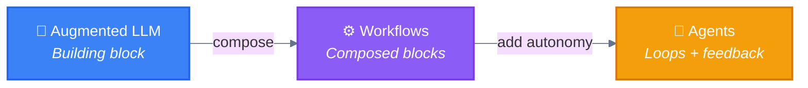

| Baseline | Workflows | Agents |
|----------|-----------|--------|
| [0. 🏎️ Direct Execution](#0-️-baseline-direct-execution) | [1. ⛓️ Prompt Chaining](#1-️-prompt-chaining) | [6. 🐉 Autonomous](04-AGENTS.md#1--autonomous-agents) |
| *(single augmented LLM call)* | [2. 🚦 Routing](#2--routing) | *(self-directed loops)* |
| | [3. 🛤️ Parallelization](#3-️-parallelization) | |
| | [4. 🦑 Orchestrator-Workers](#4--orchestrator-workers) | |
| | [5. 🩻 Evaluator-Optimizer](#5--evaluator-optimizer) | |

> **Key characteristic:** The **CODE** controls the flow, not the LLM

---

## Building Block: The Augmented LLM

> The basic building block of agentic systems is an LLM enhanced with **retrieval**, **tools**, and **memory**.

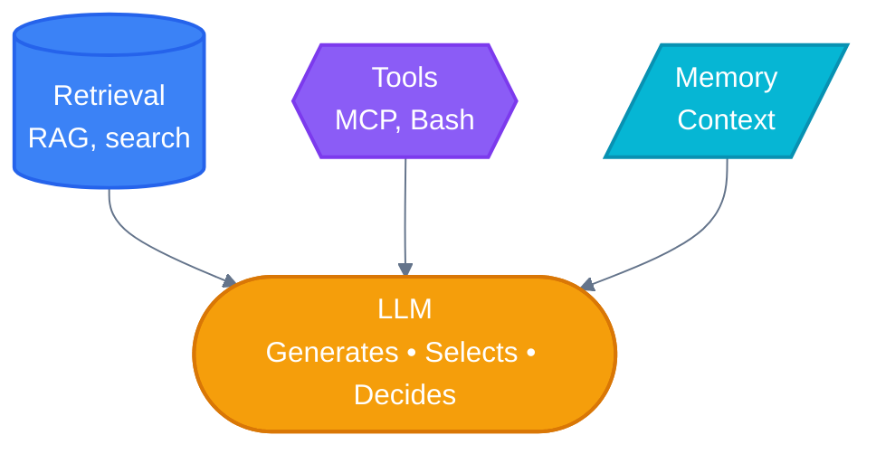

> **Key insight:** Focus on tailoring capabilities to your specific use case and ensuring they provide an easy, well-documented interface for the LLM.

All workflows below assume each LLM call has access to these augmented capabilities.

---

## 📑 Table of Contents

| # | Pattern | Description | Complexity |
|---|---------|-------------|:----------:|
| 0 | [🏎️ Baseline](#0--baseline-direct-execution) | Single augmented LLM call | None |
| 1 | [⛓️ Prompt Chaining](#1-️-prompt-chaining) | Sequential steps, output→input | Low |
| 2 | [🚦 Routing](#2--routing) | Classify then dispatch | Low |
| 3 | [🛤️ Parallelization](#3-️-parallelization) | Concurrent independent tasks | Medium |
| 4 | [🦑 Orchestrator-Workers](#4--orchestrator-workers) | Manager + specialized workers | High |
| 5 | [🩻 Evaluator-Optimizer](#5--evaluator-optimizer) | Generate → Evaluate → Improve | Medium |
| | [Variants](#workflow-variants) | Wizard, Parallel Tools, Clone | — |
| | [Mechanisms](#implementation-mechanisms) | Progressive Skills, Programmatic | — |

> **Note:** Anthropic lists 5 workflows. We include "Baseline" (Direct Execution) as pattern #0 to show the progression from simple to complex. It represents the foundational single LLM call before orchestration is added.

---

## Terminology

| Symbol | Term | Description |
|:------:|------|-------------|
| 🐔 | **Main Agent** | Claude Code orchestrator (the hen that coordinates) |
| 🐦 | **Subagent** | Delegated worker spawned via Task (the bird) |
| 🪺 | **Spawn (Task)** | Action to create 🐦 subagents (via Task built-in tool) |
| 📚 | **Skill** | Loaded knowledge that enhances 🐔 capabilities |
| 🚧 | **Gate** | Checkpoint that validates output before proceeding to next step |

### Hierarchy

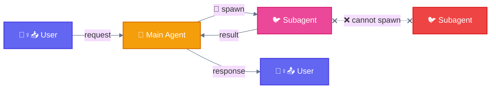

> **Rule:** 🐦 Subagents CANNOT spawn other 🐦 subagents (flat hierarchy)

---

## Decision Tree

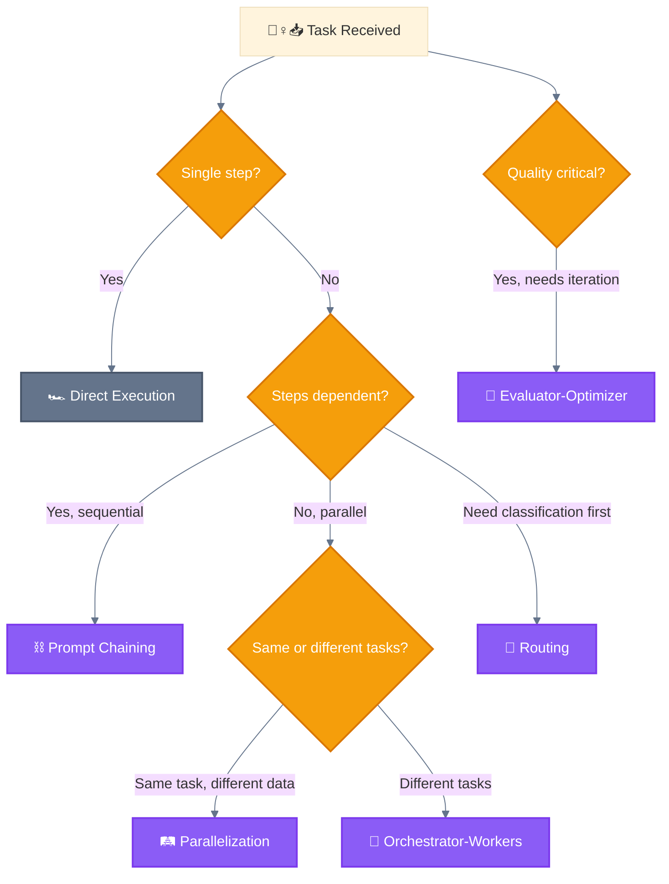

---

## 0. 🏎️ Baseline (Direct Execution)

> **Definition:** Single augmented LLM call without orchestration — the foundation before adding workflow complexity. Not counted as a workflow by Anthropic, but included here to show the full progression.

### Diagram


### When to use this workflow

- Simple, single-step tasks
- No need for specialization
- Quick operations (file read, simple edit, search)

### Examples where direct execution is useful

- "What's in the config.json file?"
- "Add a console.log statement to this function"
- "Search for usages of `useState`"

### When NOT to use

- Complex multi-step workflows
- Tasks requiring multiple specializations
- Large-scale operations

---

## 1. ⛓️ Prompt Chaining

> **Definition:** Decompose a task into a sequence of steps, where each LLM call processes the output of the previous one.

### Diagram

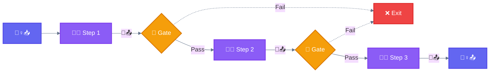

### 🚧 Gate

> **Definition:** A checkpoint between steps that validates the output before proceeding. If validation fails, the chain exits early instead of propagating errors downstream.

**Gates can check for:**
- Output format/structure validity
- Quality thresholds (confidence scores, completeness)
- Safety checks (content moderation, guardrails)
- Business rules (required fields, constraints)

### When to use this workflow

This workflow is ideal for situations where the task can be easily and cleanly decomposed into fixed subtasks. The main goal is to trade off latency for higher accuracy, by making each LLM call an easier task.

### Examples where prompt chaining is useful

| Use Case | Chain |
|----------|-------|
| Marketing | Generate copy → Translate to target language |
| Documents | Write outline → Validate criteria → Write document |
| Code generation | Plan → Implement → Review |
| Data transformation | Parse → Transform → Validate |

### Example Flow

```
Step 1: "Extract all function names from this code"
        → [list of functions]

Step 2: "For each function, identify parameters and return types"
        → [function signatures]

Step 3: "Generate documentation for each function"
        → [documented code]
```

### When NOT to use

- Steps can be done independently (use 🛤️ Parallelization)
- Simple single-step tasks (use 🏎️ Direct Execution)

### Variant: 🧙 Wizard Workflow

Multi-step process with explicit 🙆‍♀️ user confirmation at each phase using ❓ `AskUserQuestion`.

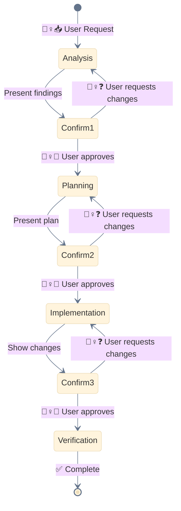

**Use 🧙 Wizard for:**
- Destructive operations (migrations, deletions)
- Complex refactoring
- Multi-stakeholder decisions

---

## 2. 🚦 Routing

> **Definition:** Classify an input and direct it to a specialized followup task. This allows separation of concerns and more specialized prompts.

### Diagram

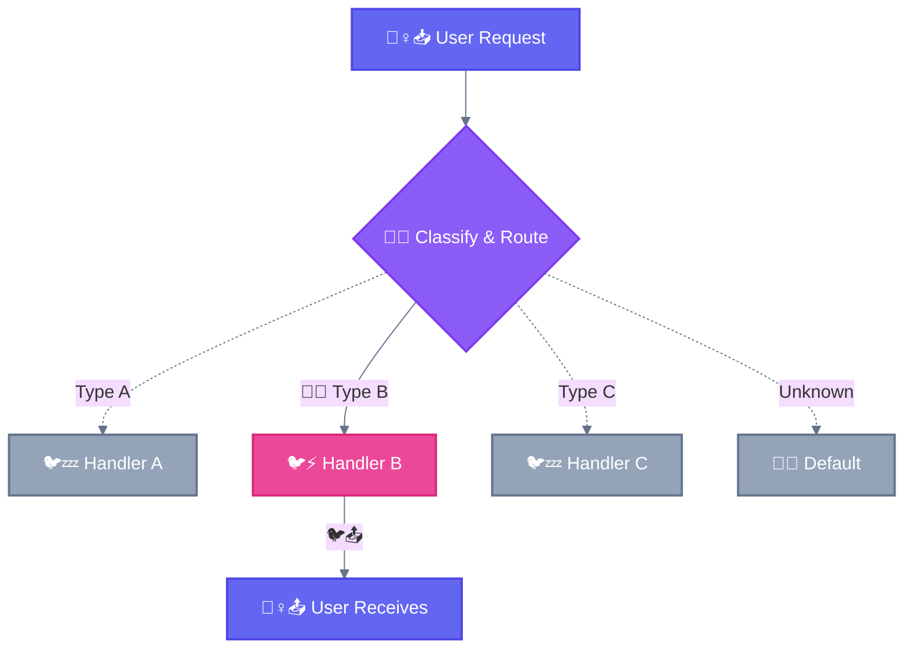

### Key Insight

```
┌─────────────────────────────────────────────────────────────────────────────┐
│  🚦 ROUTING: Choose ONE branch                                              │
├─────────────────────────────────────────────────────────────────────────────┤
│                                                                             │
│  Logic: if/else, switch/case                                               │
│  Question: "Where should I send this?"                                      │
│  Result: Single output from chosen handler                                  │
│                                                                             │
│  Analogy: Train switch → One train takes ONE track                         │
│                                                                             │
└─────────────────────────────────────────────────────────────────────────────┘
```

### When to use this workflow

Routing works well for complex tasks where there are distinct categories that are better handled separately, and where classification can be handled accurately.

### Examples where routing is useful

| Use Case | Routes |
|----------|--------|
| Customer support | Bug → Tech Team, Billing → Finance, General → FAQ |
| Code tasks | Bug fix → Debugger, New feature → Builder |
| Model routing | Easy → Claude Haiku 4.5, Hard → Claude Sonnet 4.5 |
| Content | Question → Q&A handler, Task → Executor |

### When NOT to use

- All inputs require same processing
- Classification is unreliable
- Categories overlap significantly

---

## 3. 🛤️ Parallelization

> **Definition:** Execute independent tasks simultaneously and aggregate outputs programmatically. Manifests in two key variations: **Sectioning** and **Voting**.

### Core Concept

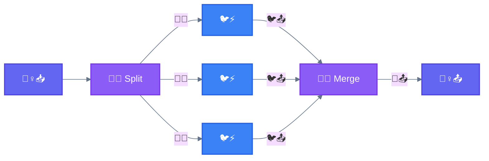

### Key Insight

```
┌─────────────────────────────────────────────────────────────────────────────┐
│  ⚠️  IMPORTANT: Parallelization vs Orchestrator-Workers                    │
├─────────────────────────────────────────────────────────────────────────────┤
│                                                                             │
│  In Parallelization, all spawned subagents are IDENTICAL.                   │
│  Same prompt, same capabilities. They are INTERCHANGEABLE.                  │
│                                                                             │
│  🛤️ Parallelization:        🐦⚡ = 🐦⚡ = 🐦⚡   (clones)                      │
│  🦑 Orchestrator-Workers:  🐦🔒 ≠ 🐦⚡ ≠ 🐦🎨   (specialists)                │
│                                                                             │
└─────────────────────────────────────────────────────────────────────────────┘
```

### 2 Types of Parallelization

#### Type 1: 🛤️ Sectioning (Split DATA)

Break a task into independent subtasks run in parallel, then combine ALL results.

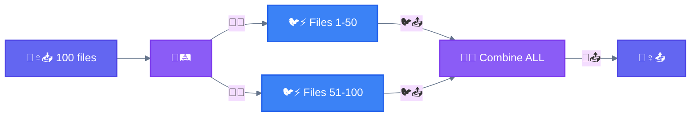

**Examples:**
- Guardrails: One instance processes queries, another screens for inappropriate content
- Evals: Each LLM call evaluates a different aspect of model performance

#### Type 2: 🗳️ Voting (Same TASK, pick BEST)

Run the same task multiple times to get diverse outputs, then select the best.

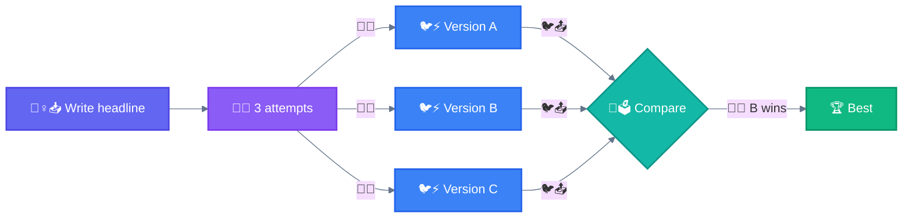

**Examples:**
- Code vulnerability review with multiple prompts
- Content moderation with different vote thresholds

### Summary

| Type | Workers | Input | Output |
|------|---------|-------|--------|
| **🛤️ Sectioning** | IDENTICAL | Different DATA chunks | Combine ALL |
| **🗳️ Voting** | IDENTICAL | Same DATA | Pick ONE best |

### When to use this workflow

Parallelization is effective when the divided subtasks can be parallelized for speed, or when multiple perspectives are needed for higher confidence results.

### When NOT to use

- Tasks depend on each other's output
- Sequential order matters
- Limited resources

### Variant: 🚂 Parallel Tool Calling

Execute multiple independent 🔧 tool calls in a single message for efficiency.

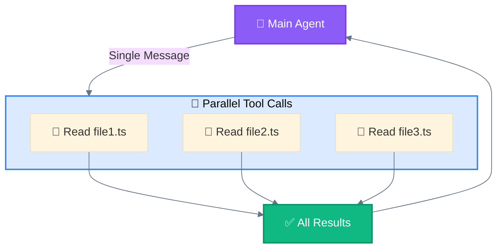

### Variant: 🧬 Master-Clone

Spawn multiple isolated 🐦 instances handling independent domains with no shared state.

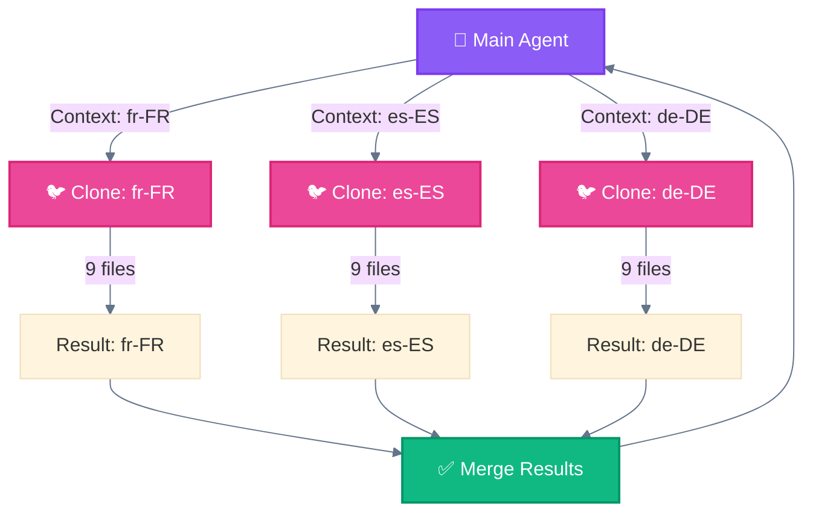

---

## 4. 🦑 Orchestrator-Workers

> **Definition:** A central LLM dynamically breaks down tasks, delegates them to worker LLMs, and synthesizes their results.

### Diagram

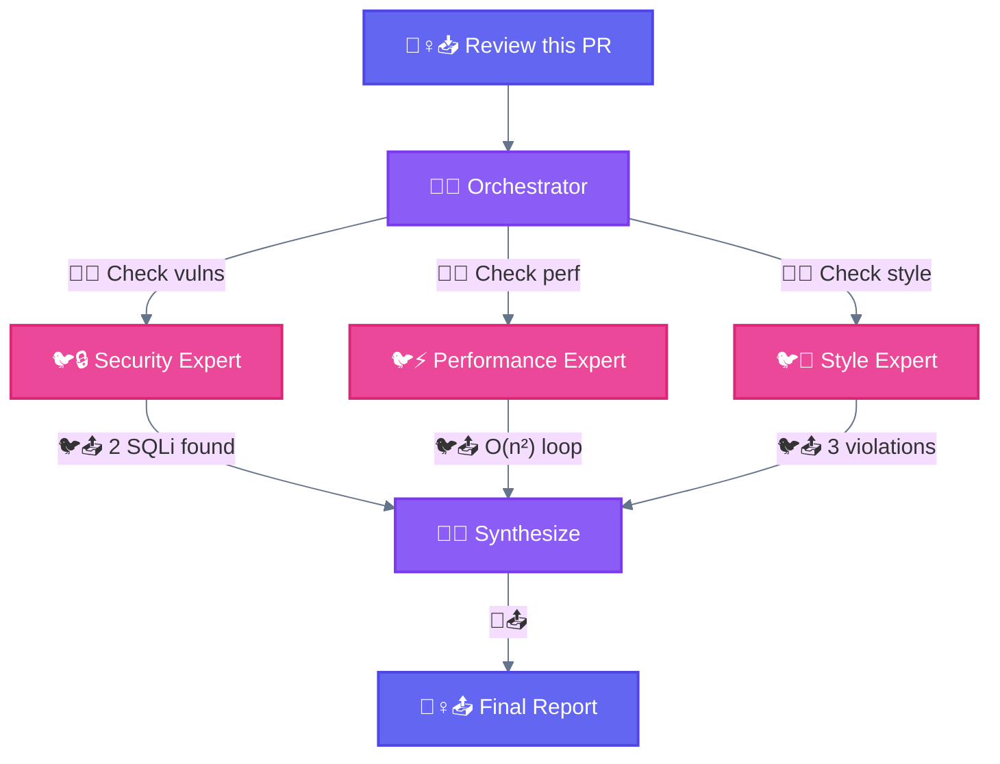

### Key Insight

```
┌─────────────────────────────────────────────────────────────────────────────┐
│  🦑 ORCHESTRATOR-WORKERS: Different specialists                             │
├─────────────────────────────────────────────────────────────────────────────┤
│                                                                             │
│  Each 🐦 subagent has a DIFFERENT expertise and does a DIFFERENT task.     │
│                                                                             │
│  Key difference from 🛤️ Parallelization: subtasks aren't pre-defined,      │
│  but determined by the orchestrator based on the specific input.            │
│                                                                             │
│  Analogy: Hospital team → Different experts collaborate                     │
│           (Chef + Pastry + Sommelier, not 3 cooks making same recipe)      │
│                                                                             │
│  Compare:                                                                   │
│  - 🛤️ Parallelization: Same worker + Different data (assembly line)        │
│  - 🦑 Orchestration: Different workers + Same data (expert team)           │
│                                                                             │
└─────────────────────────────────────────────────────────────────────────────┘
```

### When to use this workflow

This workflow is well-suited for complex tasks where you can't predict the subtasks needed. The key difference from parallelization is its flexibility—subtasks aren't pre-defined, but determined by the orchestrator based on the specific input.

### Examples where orchestrator-workers is useful

| Use Case | Orchestration |
|----------|---------------|
| Coding products | Make complex changes to multiple files dynamically |
| Search tasks | Gather and analyze from multiple sources |
| PR Review | Security + Performance + Style experts |

### Main Agent Responsibilities

| Responsibility | Description |
|----------------|-------------|
| **Decomposition** | Break complex task into subtasks |
| **Assignment** | Route subtasks to appropriate 🐦 subagents |
| **Monitoring** | Track 🐦 subagent progress |
| **Synthesis** | Combine results into coherent output |

### 🐦 Subagent Definition

```markdown
# .claude/agents/code-reviewer.md

---
name: code-reviewer
description: Reviews code for quality, security, and best practices
tools: Read, Grep, Glob
---

You are a senior code reviewer specializing in security and quality.

## Your Task
Review the provided code and report:
1. Security vulnerabilities
2. Performance issues
3. Code quality concerns
4. Suggested improvements

## Output Format
- ❌ CRITICAL: Issues requiring immediate attention
- ⚠️ WARNING: Should be addressed
- ℹ️ INFO: Suggestions for improvement
```

### Critical Rules

| Rule | Explanation |
|------|-------------|
| **No nested subagents** | 🐦 Subagents cannot spawn other 🐦 subagents |
| **Isolated context** | Each 🐦 subagent starts fresh, no shared memory |
| **Report to orchestrator** | Results flow back to 🐔 Main Agent only |

### When NOT to use

- Simple tasks not worth decomposition overhead
- Workers need heavy inter-communication

---

## 5. 🩻 Evaluator-Optimizer

> **Definition:** One LLM call generates a response while another provides evaluation and feedback in a loop until quality threshold is met.

### Diagram

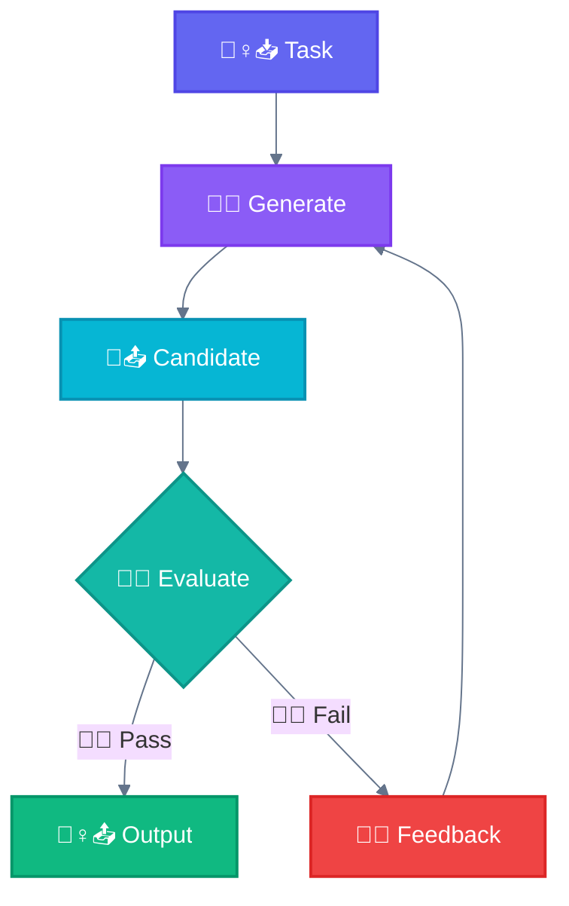

### Detailed Flow

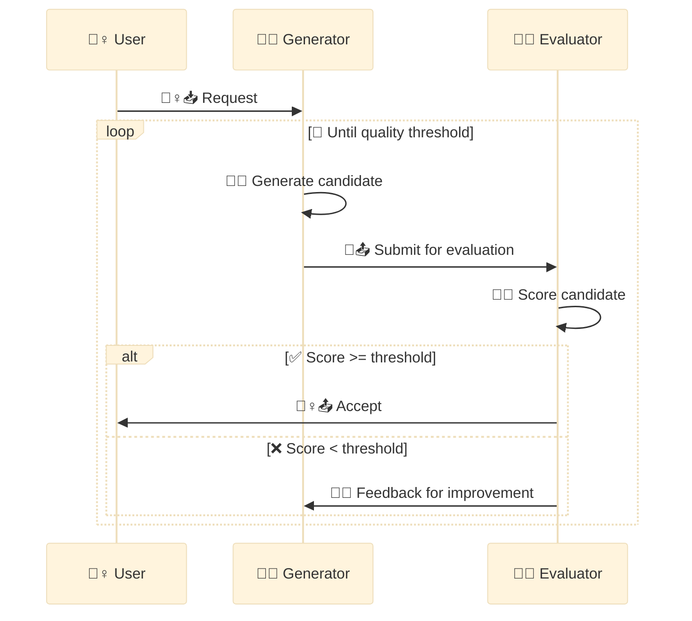

### When to use this workflow

This workflow is particularly effective when we have clear evaluation criteria, and when iterative refinement provides measurable value. Two signs of good fit:
1. LLM responses can be demonstrably improved when feedback is articulated
2. The LLM can provide such feedback

### Examples where evaluator-optimizer is useful

| Domain | Criteria | Use Case |
|--------|----------|----------|
| **Code** | Tests pass, lint clean, no security issues | Code generation |
| **Text** | Clarity score, factual accuracy, tone match | Literary translation |
| **Search** | Comprehensiveness, relevance | Complex research tasks |

### Example: Code Generation

```
Generator: Write function to parse CSV

Attempt 1: Basic implementation
Evaluator: "Missing error handling for malformed input"

Attempt 2: Added try/catch
Evaluator: "Not handling empty files"

Attempt 3: Complete implementation
Evaluator: "Pass - all criteria met"
```

### Advanced: Self-Correction Chains

You can chain prompts to have Claude **review its own work**. This catches errors and refines outputs, especially for high-stakes tasks.

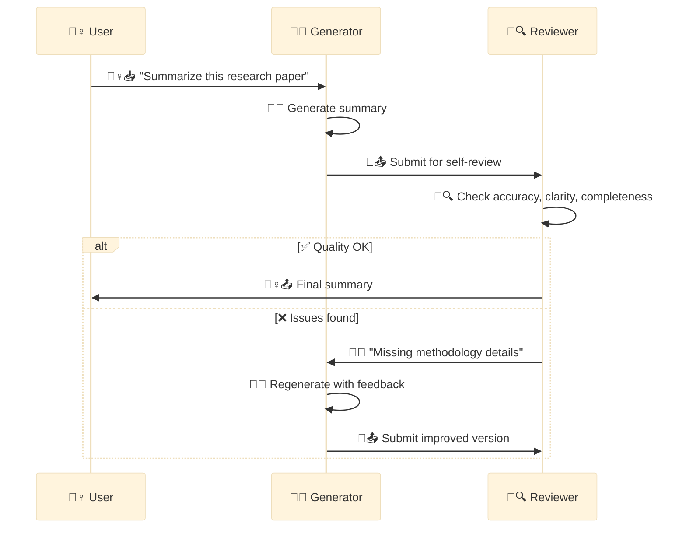

**Use Self-Correction for:**
- Research summaries requiring accuracy
- Code that must meet strict criteria
- Content requiring specific style/tone

### When NOT to use

- First attempt is usually good enough
- No clear quality metrics
- Time constraints prevent iteration

---

## Workflow Variants

| Variant | Parent | Emoji | Description |
|---------|--------|-------|-------------|
| **Wizard Workflow** | ⛓️ Prompt Chaining | 🧙 | Human checkpoints via AskUserQuestion |
| **Parallel Tool Calling** | 🛤️ Parallelization | 🚂 | Multiple tools in single response |
| **Master-Clone** | 🛤️ Parallelization | 🧬 | Same agent, parallel instances |

---

## Implementation Mechanisms

These are **implementation mechanisms** in Claude Code, not workflows themselves.

### 📚 Progressive Skills

Load 📚 skills on-demand to enhance 🐔 agent capabilities for specific task types.

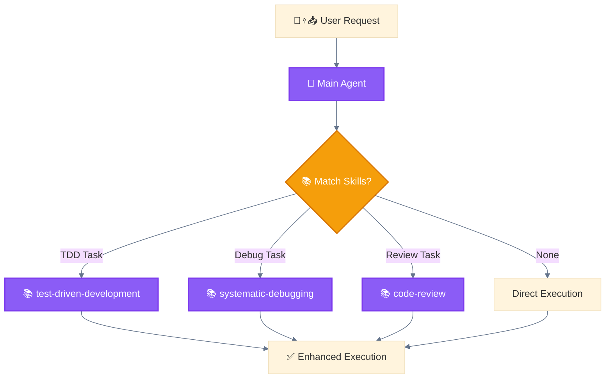

**Purpose:** Route execution through specialized methodologies (implements 🚦 Routing pattern).

### 🎛️ Programmatic Orchestration

External code controls 🐔 agent invocation and workflow logic rather than pure prompt-based control.

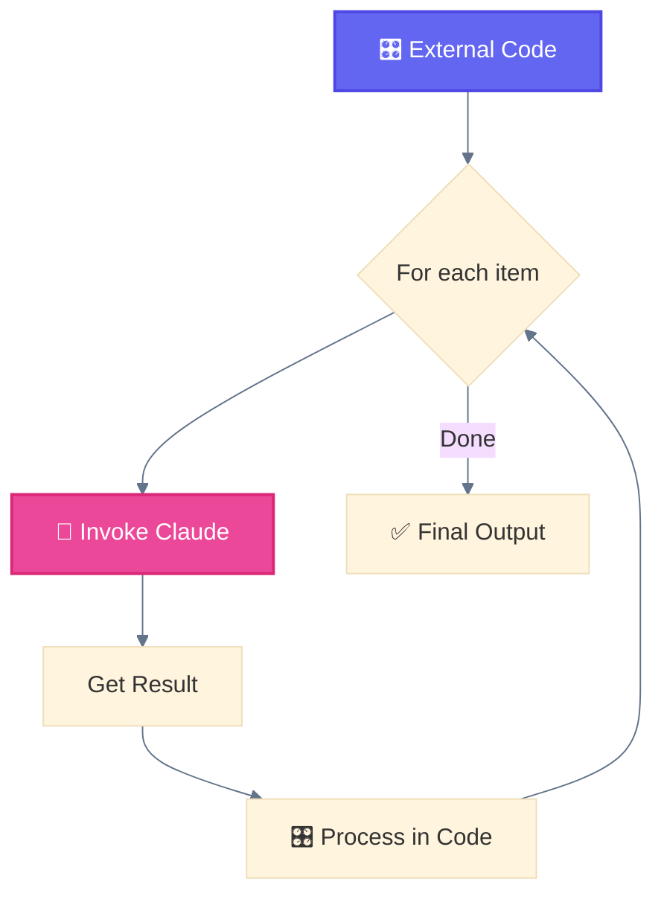

**Purpose:** ⛓️ Prompt Chaining with external control (CI/CD, batch processing, API automation).

**Implementation:**
```python
# 🎛️ External Python script orchestrating Claude
import anthropic

client = anthropic.Anthropic()

locales = ["fr-FR", "es-ES", "de-DE"]
results = []

for locale in locales:
    response = client.messages.create(
        model="claude-sonnet-4-20250514",
        messages=[{"role": "user", "content": f"Generate for {locale}"}]
    )
    results.append({"locale": locale, "content": response.content})
    save_progress(results)  # 🎛️ Code-controlled checkpointing
```

---

## Workflow Summary

```
┌──────────────────────────┬─────────────┬─────────────┬──────────────┬───────────┐
│ Pattern                  │ Complexity  │ Parallelism │ Human-Loop   │ Iteration │
├──────────────────────────┼─────────────┼─────────────┼──────────────┼───────────┤
│ 0. 🏎️ Baseline           │ None        │ None        │ None         │ None      │
├──────────────────────────┼─────────────┼─────────────┼──────────────┼───────────┤
│ 1. ⛓️ Prompt Chaining     │ Low         │ None        │ Optional     │ Linear    │
│ 2. 🚦 Routing             │ Low         │ None        │ None         │ None      │
│ 3. 🛤️ Parallelization     │ Medium      │ High        │ Optional     │ None      │
│ 4. 🦑 Orchestrator-Workers│ High        │ High        │ Optional     │ As needed │
│ 5. 🩻 Evaluator-Optimizer │ Medium      │ Optional    │ Optional     │ Loop      │
└──────────────────────────┴─────────────┴─────────────┴──────────────┴───────────┘
```

---

## Best Practices

### Permission Modes

| Mode | Behavior | Use Case |
|------|----------|----------|
| `default` | Asks permission for each tool call | Read-only operations, validation |
| `acceptEdits` | Auto-approves Write/Edit operations | Generation after 🧙 user confirmation |
| `bypassPermissions` | All tools auto-approved | Trusted autonomous workflows |

### Parallelization Limits

| Type | Recommended Max | Risk if Exceeded |
|------|-----------------|------------------|
| 🐦 Concurrent Subagents | **10-15** | Context overflow, memory pressure |
| 🔌 MCP calls per subagent | **5** | Rate limit errors |
| 🪺 Task calls per message | **10** | API limits, timeouts |

---

<div align="center">

**━━━━━━━━━━━━━━━━━━━━━━━━━━━━━━━━━━━━━━━━━━━━━━━━**

[← 02 Architecture](02-LAYER-ARCHITECTURE.md) • [🏠 Home](README.md) • [04 Agents →](04-AGENTS.md)

</div>
