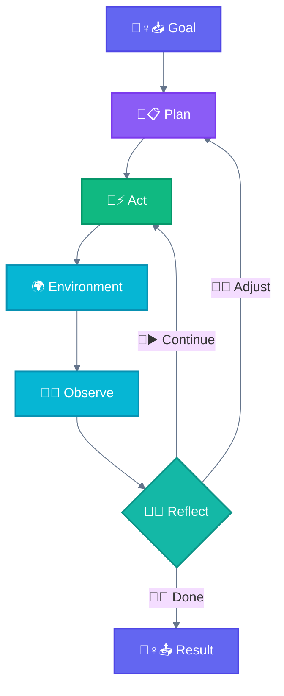
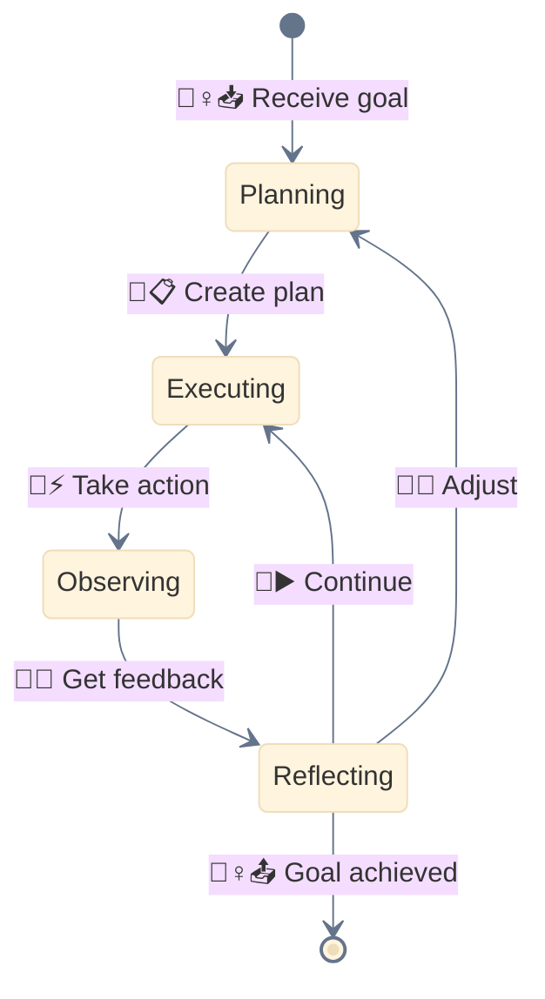
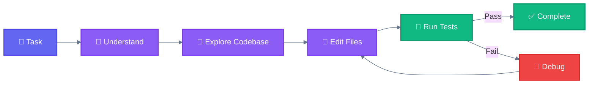
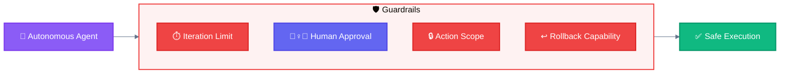
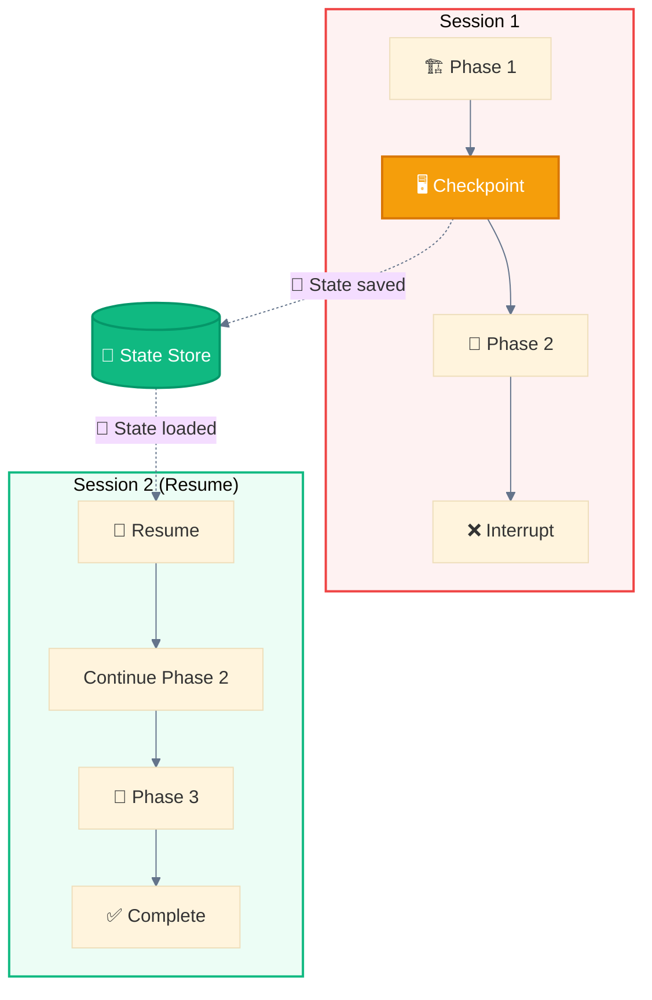

<div align="center">

[🏠 Home](README.md) • [📖 Overview](00-OVERVIEW.md) • **04 Agents**

━━━━━━━━━━●━━━━━━━━━━━━━━━━━━━━ `4/8`

[← 03 Workflows](03-WORKFLOWS.md) • [05 Use Cases →](05-USE-CASES.md)

</div>

---

# Agents

> **Definition (Anthropic):** Systems where LLMs **dynamically direct their own processes and tool usage**, maintaining control over how they accomplish tasks.
>
> — [Building Effective Agents](https://www.anthropic.com/engineering/building-effective-agents), December 2024

```
┌─────────────────────────────────────────────────────────────────────────────┐
│                                AGENTS                                        │
│                                                                             │
│  LLMs DYNAMICALLY direct their own processes and tool usage                 │
│                                                                             │
│  Key characteristic: The LLM controls the flow, not the code                │
│                                                                             │
│  ┌───────────────────────────────────────────────────────────────────────┐ │
│  │  🐉 Autonomous Agents                                                 │ │
│  │     ├── Long-running, self-directed execution                         │ │
│  │     ├── Plan → Act → Observe → Reflect loop                          │ │
│  │     └── Variant: 🖥️ Multi-Window Context                              │ │
│  └───────────────────────────────────────────────────────────────────────┘ │
└─────────────────────────────────────────────────────────────────────────────┘
```

---

## Workflows vs Agents

```
┌─────────────────────────────────────────────────────────────────────────────┐
│                    WORKFLOWS vs AGENTS — Key Distinction                    │
├────────────────────────────────────┬────────────────────────────────────────┤
│            WORKFLOWS               │              AGENTS                     │
├────────────────────────────────────┼────────────────────────────────────────┤
│  CODE controls the flow            │  LLM controls the flow                 │
│  Predefined paths                  │  Dynamic decisions                     │
│  Predictable execution             │  Adaptive behavior                     │
│  Lower autonomy                    │  Higher autonomy                       │
│  Lower risk                        │  Higher risk (need guardrails)         │
│  Faster, cheaper                   │  Slower, more expensive                │
│                                    │                                        │
│  → Use for WELL-DEFINED tasks      │  → Use for OPEN-ENDED problems         │
└────────────────────────────────────┴────────────────────────────────────────┘
```

---

## 📑 Table of Contents

| # | Content | Description |
|---|---------|-------------|
| 6 | [🐉 Autonomous Agents](#-autonomous-agents) | Self-directed execution with feedback |
| | [Agent Loop](#the-agent-loop) | Plan → Act → Observe → Reflect |
| | [When to Use](#when-to-use-agents) | Open-ended problems, scaling trusted tasks |
| | [Risk Management](#risk-management) | Guardrails and safety |
| | [🖥️ Multi-Window Context](#variant--multi-window-context) | State persistence across sessions |
| | [Best Practices](#best-practices) | ACI design, tool documentation |

---

## 🐉 Autonomous Agents

> **Definition:** Long-running agents that independently plan, execute, and adapt based on environment feedback. They begin with a command or discussion with the human user, then plan and operate independently, potentially returning for further information or judgement.

### Diagram



### The Agent Loop



### Key Insight

```
┌─────────────────────────────────────────────────────────────────────────────┐
│  🐉 AUTONOMOUS AGENTS: What Makes Them Different                            │
├─────────────────────────────────────────────────────────────────────────────┤
│                                                                             │
│  Agents are emerging in production as LLMs mature in key capabilities:      │
│                                                                             │
│  ✅ Understanding complex inputs                                            │
│  ✅ Engaging in reasoning and planning                                      │
│  ✅ Using tools reliably                                                    │
│  ✅ Recovering from errors                                                  │
│                                                                             │
│  During execution, it's CRUCIAL for agents to gain "ground truth"           │
│  from the environment at each step (tool results, code execution)           │
│  to assess their progress.                                                  │
│                                                                             │
│  Agents can pause for human feedback at checkpoints or when                 │
│  encountering blockers.                                                     │
│                                                                             │
└─────────────────────────────────────────────────────────────────────────────┘
```

### Characteristics

| Characteristic | Description |
|----------------|-------------|
| **Goal-directed** | Works toward specified objective |
| **Adaptive** | Adjusts based on environment feedback |
| **Self-directed** | Decides next actions independently |
| **Persistent** | Continues until goal achieved or stopping condition |

### When to use agents

Agents can be used for **open-ended problems** where:
- It's difficult or impossible to predict the required number of steps
- You can't hardcode a fixed path
- The LLM will potentially operate for many turns
- You have some level of trust in its decision-making

Agents' autonomy makes them ideal for **scaling tasks in trusted environments**.

### Examples where agents are useful

| Domain | Example | Why Agent? |
|--------|---------|------------|
| **Coding** | SWE-bench tasks, multi-file edits | Can't predict which files need changes |
| **Computer Use** | Claude uses a computer to accomplish tasks | Open-ended interaction |
| **Research** | Complex investigations with unknown scope | Adaptive information gathering |
| **Bug Investigation** | Tracing issues through codebase | Unknown path to root cause |

### Example: Bug Investigation

```
Goal: "Fix the login timeout bug"

Agent:
1. PLAN: Need to find where timeout is set
2. ACT: Search codebase for "timeout" in auth
3. OBSERVE: Found 3 locations
4. REFLECT: Most likely in session config
5. ACT: Read session config file
6. OBSERVE: Default timeout is 30 minutes
7. REFLECT: User reported issue after 5 minutes
8. ACT: Check if there's an override
9. ...continues until resolved...
```

### High-level Coding Agent Flow



### When NOT to use agents

- Predictable tasks with known steps (use 🛤️ Workflows)
- No rollback capability
- Tight time constraints
- Untrusted environments

---

## Risk Management

> **Warning:** The autonomous nature of agents means higher costs, and the potential for compounding errors. We recommend extensive testing in sandboxed environments, along with appropriate guardrails.



### Essential Guardrails

| Guardrail | Purpose | Implementation |
|-----------|---------|----------------|
| **⏱️ Iteration Limit** | Prevent infinite loops | Max turns, timeout |
| **🙆‍♀️ Human Checkpoints** | Maintain oversight | AskUserQuestion at key decisions |
| **🔒 Action Scope** | Limit blast radius | Tool restrictions, sandboxing |
| **↩️ Rollback** | Enable recovery | Git commits, state snapshots |
| **📊 Logging** | Audit trail | Record all agent actions |

### Stopping Conditions

```
┌─────────────────────────────────────────────────────────────────────────────┐
│  WHEN TO STOP                                                               │
├─────────────────────────────────────────────────────────────────────────────┤
│                                                                             │
│  ✅ Goal achieved                                                           │
│  ⏱️ Maximum iterations reached                                              │
│  🚫 Unrecoverable error                                                     │
│  🙆‍♀️ Human intervention requested                                           │
│  💰 Cost threshold exceeded                                                 │
│                                                                             │
└─────────────────────────────────────────────────────────────────────────────┘
```

---

## Variant: 🖥️ Multi-Window Context

> **Definition:** Implement checkpointing to save 💾 state and resume from interruptions in long-running workflows across multiple Claude Code sessions.



### When to use Multi-Window Context

- Large-scale generation (1000+ files)
- Long research tasks
- Multi-day workflows
- Error recovery needs
- Context window limitations

### Implementation Pattern

```
Session 1:
  1. Work on Phase 1
  2. Save checkpoint (progress, decisions, context)
  3. Continue until context limit or interruption

Session 2:
  1. Load checkpoint
  2. Resume from saved state
  3. Continue execution
```

---

## Best Practices

### Agent-Computer Interface (ACI)

> Think about how much effort goes into human-computer interfaces (HCI), and plan to invest just as much effort in creating good **agent-computer interfaces (ACI)**.

```
┌─────────────────────────────────────────────────────────────────────────────┐
│  ACI DESIGN PRINCIPLES                                                      │
├─────────────────────────────────────────────────────────────────────────────┤
│                                                                             │
│  1. Put yourself in the model's shoes                                       │
│     Is it obvious how to use this tool based on description?                │
│                                                                             │
│  2. Include in tool definitions:                                            │
│     - Example usage                                                         │
│     - Edge cases                                                            │
│     - Input format requirements                                             │
│     - Clear boundaries from other tools                                     │
│                                                                             │
│  3. Test how the model uses your tools                                      │
│     Run many example inputs, see mistakes, iterate                          │
│                                                                             │
│  4. Poka-yoke your tools                                                    │
│     Change arguments so it's harder to make mistakes                        │
│                                                                             │
└─────────────────────────────────────────────────────────────────────────────┘
```

### Tool Documentation

A good tool definition is like writing a great docstring for a junior developer:

```markdown
# Example: File Edit Tool

**Purpose:** Edit files with precise replacements

**Parameters:**
- `file_path`: Absolute path to file (required)
- `old_string`: Exact text to replace (must be unique)
- `new_string`: Replacement text

**Edge Cases:**
- If old_string is not unique, use more context
- For multi-line edits, include surrounding lines

**Example:**
```python
Edit(
    file_path="/src/utils.ts",
    old_string="function foo() {",
    new_string="function bar() {"
)
```
```

### Three Core Principles

> From Anthropic's "Building Effective Agents":

| Principle | Description |
|-----------|-------------|
| **1. Simplicity** | Maintain simplicity in your agent's design |
| **2. Transparency** | Explicitly show the agent's planning steps |
| **3. ACI Design** | Carefully craft agent-computer interface through thorough tool documentation and testing |

---

## Agent Summary

```
┌──────────────────────────┬─────────────┬─────────────┬──────────────┬───────────┐
│ Agent                    │ Complexity  │ Parallelism │ Human-Loop   │ Iteration │
├──────────────────────────┼─────────────┼─────────────┼──────────────┼───────────┤
│ 🐉 Autonomous Agent      │ Very High   │ Variable    │ Recommended  │ Adaptive  │
└──────────────────────────┴─────────────┴─────────────┴──────────────┴───────────┘
```

### Comparison with Workflows

| Aspect | 🛤️ Workflows | 🐉 Agents |
|--------|-------------|-----------|
| **Control** | Code-directed | LLM-directed |
| **Path** | Predefined | Dynamic |
| **Steps** | Known upfront | Discovered at runtime |
| **Complexity** | Low to High | Very High |
| **Cost** | Lower, predictable | Higher, variable |
| **Risk** | Lower | Higher (needs guardrails) |
| **Use Case** | Well-defined tasks | Open-ended problems |

---

## Flow Examples

```
🐉 AUTONOMOUS AGENTS
🙋‍♀️📥 ──► 🐔📋 ──► 🐔⚡ ──► 🐔👀 ──► 🐔💭 ──┬──► 🐔🔄 ──► 🐔📋 (loop)
Goal       Plan      Act      Observe   Reflect │
                                                └──► 🐔📤 ──► 📤💁‍♀️ (done)

🖥️ MULTI-WINDOW CONTEXT
Session 1: 🙋‍♀️📥 ──► 🐔📋 ──► 🐔⚡ ──► 🖥️💾 ──► [Context Limit]
                                      ↓
Session 2: 🖥️💾 ──► 🐔⚡ ──► 🐔👀 ──► 🐔💭 ──► 💁‍♀️📤
```

---

<div align="center">

**━━━━━━━━━━━━━━━━━━━━━━━━━━━━━━━━━━━━━━━━━━━━━━━━**

[← 03 Workflows](03-WORKFLOWS.md) • [🏠 Home](README.md) • [05 Use Cases →](05-USE-CASES.md)

</div>
