```mermaid
%%{init: {'theme': 'base', 'themeVariables': {'lineColor': '#64748b'}}}%%
flowchart TB
    classDef main fill:#8b5cf6,stroke:#7c3aed,stroke-width:2px,color:#ffffff
    classDef subagent fill:#ec4899,stroke:#db2777,stroke-width:2px,color:#ffffff
    classDef tool fill:#f59e0b,stroke:#d97706,stroke-width:2px,color:#ffffff
    classDef state fill:#10b981,stroke:#059669,stroke-width:2px,color:#ffffff

    USER["🙋‍♀️📥 Research Query"] --> LEAD["🐔 Lead Agent"]:::main

    LEAD -->|"🪺 Task"| PLAN["Plan research strategy"]
    PLAN --> SPAWN["Spawn specialized researchers"]

    subgraph PARALLEL["🚂 Parallel Execution"]
        R1["🐦 Academic Researcher"]:::subagent
        R2["🐦 Industry Researcher"]:::subagent
        R3["🐦 News Researcher"]:::subagent
    end

    SPAWN --> R1 & R2 & R3

    R1 --> T1["🔌 Perplexity"]:::tool
    R2 --> T2["🔌 Firecrawl"]:::tool
    R3 --> T3["🔌 WebSearch"]:::tool

    T1 & T2 & T3 --> COLLECT["🐔 Lead Agent collects"]:::main
    COLLECT --> SYNTH["🐦 Synthesis Agent"]:::subagent
    SYNTH --> REPORT["✅ Final Report"]:::state
```

```mermaid
%%{init: {'theme': 'base', 'themeVariables': {'lineColor': '#64748b'}}}%%
flowchart TB
    classDef main fill:#8b5cf6,stroke:#7c3aed,stroke-width:2px,color:#ffffff
    classDef subagent fill:#ec4899,stroke:#db2777,stroke-width:2px,color:#ffffff
    classDef parallel fill:#3b82f6,stroke:#2563eb,stroke-width:2px,color:#ffffff
    classDef state fill:#10b981,stroke:#059669,stroke-width:2px,color:#ffffff

    PR["🙋‍♀️📥 PR Submitted"] --> ORCH["🐔 Review Orchestrator"]:::main

    ORCH -->|"Analyze scope"| SIZE{PR Size?}

    SIZE -->|"Small"| DIRECT["🏎️ Direct Review"]
    SIZE -->|"Medium"| PARALLEL["🚂 Parallel Read"]:::parallel
    SIZE -->|"Large"| SUBAGENT["🦑 Specialized Reviews"]

    subgraph SPECIALISTS["Specialist Subagents"]
        SEC["🐦 Security"]:::subagent
        PERF["🐦 Performance"]:::subagent
        STYLE["🐦 Style"]:::subagent
        TEST["🐦 Test Coverage"]:::subagent
    end

    SUBAGENT --> SEC & PERF & STYLE & TEST
    SEC & PERF & STYLE & TEST --> MERGE["🐔 Merge Findings"]:::main
    MERGE --> REPORT["✅ Review Report"]:::state

    DIRECT --> REPORT
    PARALLEL --> REPORT
```

```mermaid
%%{init: {'theme': 'base', 'themeVariables': {'lineColor': '#64748b'}}}%%
flowchart TB
    classDef wizard fill:#14b8a6,stroke:#0d9488,stroke-width:2px,color:#ffffff
    classDef subagent fill:#ec4899,stroke:#db2777,stroke-width:2px,color:#ffffff
    classDef checkpoint fill:#f59e0b,stroke:#d97706,stroke-width:2px,color:#ffffff
    classDef state fill:#10b981,stroke:#059669,stroke-width:2px,color:#ffffff

    CMD["🦴 /generate fr"] --> WIZARD["🧙 Confirm Scope"]:::wizard

    WIZARD -->|"❓ User approves"| PRIMARY["🐦 Generate fr-FR"]:::subagent

    PRIMARY --> CHECK1["🖥️ Checkpoint"]:::checkpoint
    CHECK1 --> VARIANTS["🧬 Master-Clone Variants"]

    subgraph ISOLATED["Isolated Contexts"]
        V1["🐦 fr-CA"]:::subagent
        V2["🐦 fr-BE"]:::subagent
        V3["🐦 fr-CH"]:::subagent
    end

    VARIANTS --> V1 & V2 & V3
    V1 & V2 & V3 --> CHECK2["🖥️ Validation"]:::checkpoint
    CHECK2 --> DONE["✅ 4 locales generated"]:::state
```

```mermaid
%%{init: {'theme': 'base', 'themeVariables': {'lineColor': '#64748b'}}}%%
flowchart TB
    classDef main fill:#8b5cf6,stroke:#7c3aed,stroke-width:2px,color:#ffffff
    classDef skill fill:#8b5cf6,stroke:#7c3aed,stroke-width:2px,color:#ffffff
    classDef tool fill:#f59e0b,stroke:#d97706,stroke-width:2px,color:#ffffff

    USER["🙋‍♀️📥 User Request"] --> ROUTER["🐔 Main Agent"]:::main

    ROUTER --> CLASSIFY{"🚦 Classify Intent"}

    CLASSIFY -->|"Calendar"| CAL["📚 Calendar Skill"]:::skill
    CLASSIFY -->|"Email"| EMAIL["📚 Email Skill"]:::skill
    CLASSIFY -->|"Tasks"| TASK["📚 Task Skill"]:::skill
    CLASSIFY -->|"Research"| RESEARCH["📚 Research Skill"]:::skill

    CAL --> T1["🔌 Google Calendar API"]:::tool
    EMAIL --> T2["🔌 Gmail API"]:::tool
    TASK --> T3["💁‍♀️ TodoWrite"]:::tool
    RESEARCH --> T4["🔌 Perplexity"]:::tool
```

```mermaid
%%{init: {'theme': 'base', 'themeVariables': {'lineColor': '#64748b'}}}%%
flowchart TB
    classDef main fill:#8b5cf6,stroke:#7c3aed,stroke-width:2px,color:#ffffff
    classDef subagent fill:#ec4899,stroke:#db2777,stroke-width:2px,color:#ffffff
    classDef wizard fill:#14b8a6,stroke:#0d9488,stroke-width:2px,color:#ffffff
    classDef state fill:#10b981,stroke:#059669,stroke-width:2px,color:#ffffff

    TICKET["🙋‍♀️📥 Customer Ticket"] --> TRIAGE["🐔 Triage Agent"]:::main

    TRIAGE --> CLASSIFY{"🚦 Issue Type?"}

    CLASSIFY -->|"Billing"| BILLING["🐦 Billing Agent"]:::subagent
    CLASSIFY -->|"Technical"| TECH["🐦 Tech Support"]:::subagent
    CLASSIFY -->|"General"| GEN["🐦 General Support"]:::subagent
    CLASSIFY -->|"Complex"| ESCALATE["🧙 Human Escalation"]:::wizard

    BILLING --> KB["🔌 Knowledge Base"]
    TECH --> KB
    GEN --> KB

    KB --> RESOLVE["✅ Resolution"]:::state
    ESCALATE --> HUMAN["🙋‍♀️ Human Agent"]
```

```mermaid
%%{init: {'theme': 'base', 'themeVariables': {'lineColor': '#64748b'}}}%%
flowchart TB
    classDef wizard fill:#14b8a6,stroke:#0d9488,stroke-width:2px,color:#ffffff
    classDef checkpoint fill:#f59e0b,stroke:#d97706,stroke-width:2px,color:#ffffff
    classDef state fill:#10b981,stroke:#059669,stroke-width:2px,color:#ffffff
    classDef error fill:#ef4444,stroke:#dc2626,stroke-width:2px,color:#ffffff

    START["🙋‍♀️📥 /migrate source target"] --> WIZARD["🧙 Wizard: Confirm"]:::wizard

    WIZARD -->|"❓ Approved"| P1["🏗️ Phase 1: Analyze"]
    P1 --> C1["🖥️ Checkpoint"]:::checkpoint

    C1 --> P2["🔗 Phase 2: Schema"]
    P2 --> C2["🖥️ Checkpoint"]:::checkpoint

    C2 --> P3["📝 Phase 3: Migrate"]
    P3 --> C3["🖥️ Checkpoint"]:::checkpoint

    C3 --> P4["🔮 Phase 4: Verify"]
    P4 --> DONE["✅ Complete"]:::state

    P3 -->|"Error"| ROLLBACK["❌ Rollback"]:::error
    ROLLBACK --> C2
```

<div align="center">

[🏠 Home](README.md) • [📖 Overview](00-OVERVIEW.md) • **05 Use Cases**

━━━━━━━━━━●━━━━━━━━━━━━━━━━━━━━ `5/8`

[← 04 Agents](04-AGENTS.md) • [06 Selection Guide →](06-SELECTION-GUIDE.md)

</div>

---

# Real-World Use Cases

> Validated use cases from Anthropic Engineering and production systems

## 📑 Table of Contents

| # | Use Case | Patterns |
|---|----------|----------|
| 1 | [Multi-Agent Research](#use-case-1-multi-agent-research-system) | 🦑 + 🚂 |
| 2 | [Code Review Pipeline](#use-case-2-production-code-review) | 🚂 + 🦑 |
| 3 | [Multi-Locale Generation](#use-case-3-multi-locale-content-generation) | 🧬 + 🧙 |
| 4 | [Personal Assistant](#use-case-4-intelligent-personal-assistant) | 📚 |
| 5 | [Customer Support](#use-case-5-customer-support-automation) | 🚦 + 🦑 |
| 6 | [Data Migration](#use-case-6-data-pipeline-migration) | 🧙 + 🖥️ |

---

## Quick Reference

| Use Case | Pattern | Components |
|----------|---------|------------|
| Multi-Agent Research | 🦑 Orchestrator-Workers | Lead Agent → Parallel Subagents → Synthesis |
| Code Review Pipeline | 🚂 Parallel + 🦑 Subagent | Security, Performance, Style reviewers |
| Multi-Locale Generation | 🧬 Master-Clone + 🧙 Wizard | Primary → Variants in isolation |
| Personal Assistant | 📚 Progressive Skills | Calendar, Email, Tasks routing |
| Customer Support | 🚦 Routing + 🦑 Subagent | Triage → Specialized handlers |
| Data Migration | 🧙 Wizard + 🖥️ Multi-Window | Phased with checkpoints |

---

## Use Case 1: Multi-Agent Research System

> Source: [Anthropic Engineering Blog](https://www.anthropic.com/engineering/multi-agent-research-system) - June 2025

### Problem
Synthesizing comprehensive research from multiple sources requires:
- Parallel information gathering
- Domain specialization
- Quality synthesis

### Solution Architecture



### Patterns Used

| Pattern | Role |
|---------|------|
| 🦑 Orchestrator-Workers | Lead Agent spawns specialized researchers |
| 🚂 Parallel Tool Calling | Multiple researchers work simultaneously |
| 🧬 Master-Clone | Each researcher has isolated context |

### Key Implementation Details

```python
# Lead Agent orchestrates
lead_agent_prompt = """
You coordinate research by:
1. Breaking query into research domains
2. Spawning domain-specific researchers
3. Collecting and synthesizing results
"""

# Researcher subagent (one per domain)
researcher_prompt = """
You research {domain} using available tools.
Return structured findings with citations.
"""
```

### Why This Works
- **Specialization**: Each subagent focuses on one domain
- **Parallelism**: Independent searches run concurrently
- **Isolation**: Subagents don't pollute each other's context
- **Synthesis**: Lead Agent has full picture for final output

---

## Use Case 2: Production Code Review

> Source: Derived from Anthropic patterns + VoltAgent community

### Problem
Large PRs need multiple review perspectives:
- Security vulnerabilities
- Performance bottlenecks
- Style consistency
- Test coverage

### Solution Architecture



### Patterns Used

| PR Size | Pattern | Rationale |
|---------|---------|-----------|
| 1-3 files | 🏎️ Direct Execution | No overhead needed |
| 4-10 files | 🚂 Parallel Tool Calling | Read all files concurrently |
| 10+ files | 🦑 Orchestrator-Workers | Specialized reviewers |

### Subagent Definitions

```markdown
# .claude/agents/security-reviewer.md
---
name: security-reviewer
description: Reviews code for OWASP Top 10 and security vulnerabilities
tools: Read, Grep, Glob
---

Focus on:
- SQL injection, XSS, command injection
- Authentication/authorization flaws
- Sensitive data exposure
- Dependency vulnerabilities
```

```markdown
# .claude/agents/performance-reviewer.md
---
name: performance-reviewer
description: Identifies performance bottlenecks and optimization opportunities
tools: Read, Grep, Glob
---

Focus on:
- N+1 queries
- Memory leaks
- Inefficient algorithms
- Unnecessary re-renders (React)
```

---

## Use Case 3: Multi-Locale Content Generation

> Source: AthenaKNW project architecture

### Problem
Generate localized content for 200 locales:
- Primary locales set the standard
- Variants document differences
- Content must be unique (< 70% similarity)

### Solution Architecture



### Patterns Used

| Stage | Pattern | Purpose |
|-------|---------|---------|
| Entry | 🧙 Wizard Workflows | Confirm scope before generation |
| Primary | 🦑 Orchestrator-Workers | Generate reference locale |
| Variants | 🧬 Master-Clone | Parallel, isolated generation |
| Throughout | 🖥️ Multi-Window Context | Resume on interruption |

### Key Constraint

```
⚠️ Variants use `differs_from: fr-FR` to document differences
⚠️ Each file must be standalone useful
⚠️ Similarity between same-language locales < 70%
```

---

## Use Case 4: Intelligent Personal Assistant

> Source: [Anthropic Agent SDK Documentation](https://www.anthropic.com/engineering/building-agents-with-the-claude-agent-sdk)

### Problem
Handle diverse user requests efficiently:
- Calendar management
- Email composition
- Task tracking
- Web research

### Solution Architecture



### Patterns Used

| Pattern | Implementation |
|---------|----------------|
| 🚦 Routing | Intent classification to skill selection |
| 📚 Progressive Skills | Load capability based on request type |

### Skill Loading

```markdown
# .claude/skills/calendar-management/SKILL.md
---
description: Manage calendar events, scheduling, and availability
---

## When to Use
- User mentions: meeting, schedule, calendar, availability, book

## Capabilities
- Create/update/delete events
- Check availability
- Schedule meetings with multiple participants
```

---

## Use Case 5: Customer Support Automation

> Source: Anthropic Agent SDK + industry patterns

### Problem
Handle customer inquiries at scale:
- Route to appropriate department
- Escalate complex issues
- Maintain conversation context

### Solution Architecture



### Patterns Used

| Pattern | Role |
|---------|------|
| 🚦 Routing | Classify ticket type |
| 🦑 Orchestrator-Workers | Specialized handlers |
| 🧙 Wizard Workflows | Human escalation path |

### Escalation Criteria

```python
ESCALATE_IF = [
    "sentiment == negative AND attempts > 2",
    "mentions: lawyer, sue, legal",
    "technical_complexity > threshold",
    "customer_tier == enterprise"
]
```

---

## Use Case 6: Data Pipeline Migration

> Source: Best practices from production systems

### Problem
Migrate data between systems safely:
- Destructive operations require confirmation
- Long-running needs checkpoints
- Rollback capability required

### Solution Architecture



### Patterns Used

| Pattern | Purpose |
|---------|---------|
| 🧙 Wizard Workflows | **Mandatory** for destructive operations |
| 🖥️ Multi-Window Context | Resume after interruption |
| 🚂 Parallel Tool Calling | Migrate independent tables concurrently |

### Checkpoint Data

```json
{
  "migration_id": "mig_2025_001",
  "current_phase": 3,
  "tables_completed": ["users", "orders"],
  "tables_pending": ["products", "reviews"],
  "rollback_point": "checkpoint_2"
}
```

---

## Pattern Selection by Use Case

Quick decision matrix:

| If your use case involves... | Use Pattern |
|------------------------------|-------------|
| Multiple independent searches | 🚂 Parallel Tool Calling |
| Specialized domain knowledge | 🦑 Orchestrator-Workers |
| Same task on different data | 🧬 Master-Clone |
| Critical/destructive operations | 🧙 Wizard Workflows |
| Long-running workflows (>10 min) | 🖥️ Multi-Window Context |
| External system orchestration | 🎛️ Programmatic Orchestration |
| Intent-based capability loading | 📚 Progressive Skills |

---

## VoltAgent Community Subagents

> Source: [awesome-claude-code-subagents](https://github.com/VoltAgent/awesome-claude-code-subagents) - 5.1k stars

### Categories (100+ production subagents)

| Category | Examples | Pattern |
|----------|----------|---------|
| **Core Development** | Code Writer, Refactorer, Debugger | 🏎️ Direct / 🦑 Subagent |
| **Quality Assurance** | Test Writer, Security Reviewer, Linter | 🦑 Orchestrator-Workers |
| **Data & AI** | Data Analyst, ML Pipeline, Embeddings | 🚂 Parallel + 🧬 Clone |
| **DevOps** | CI/CD Manager, Docker Builder, K8s | 🎛️ Programmatic |
| **Business** | Doc Writer, Translator, Report Generator | 🧬 Master-Clone |

### Example: Test Writer Subagent

```markdown
# .claude/agents/test-writer.md
---
name: test-writer
description: Generates comprehensive test suites with edge cases
tools: Read, Write, Grep, Glob, Bash
---

## Instructions
1. Read the source file to understand functionality
2. Identify edge cases and error conditions
3. Generate tests following project conventions
4. Run tests to verify they pass
5. Report coverage metrics
```

---

<div align="center">

**━━━━━━━━━━━━━━━━━━━━━━━━━━━━━━━━━━━━━━━━━━━━━━━━**

[← 04 Agents](04-AGENTS.md) • [🏠 Home](README.md) • [06 Selection Guide →](06-SELECTION-GUIDE.md)

</div>

