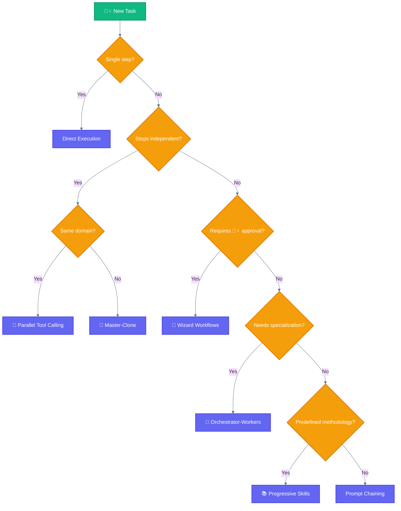
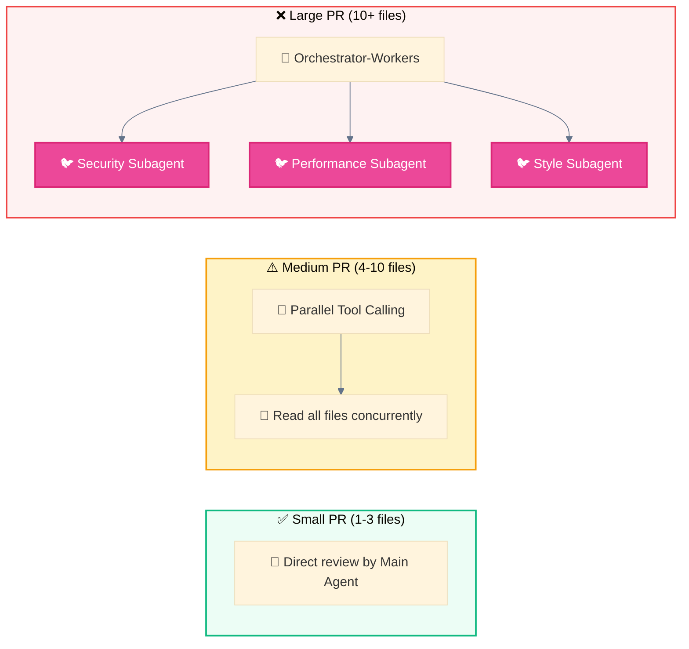
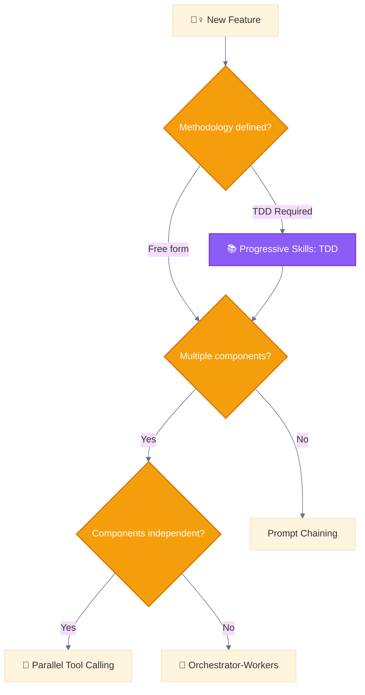
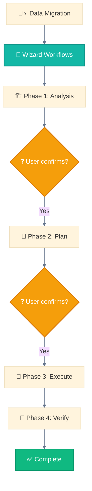
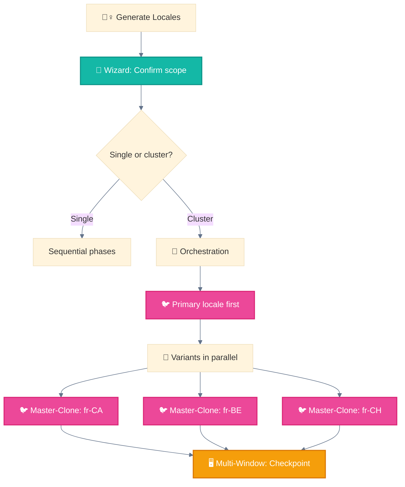
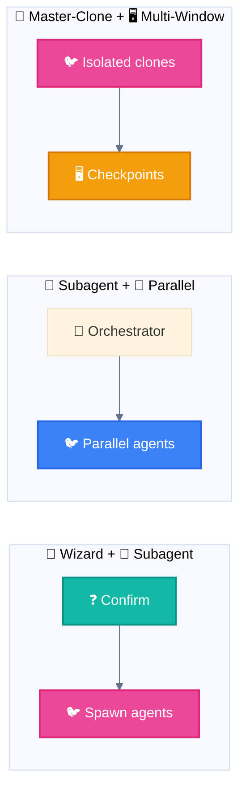
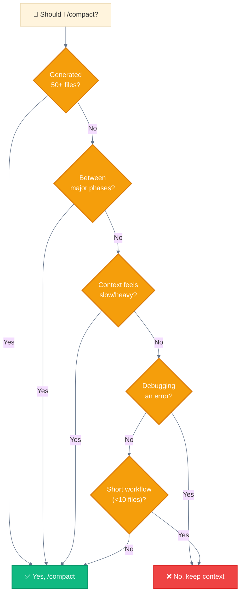
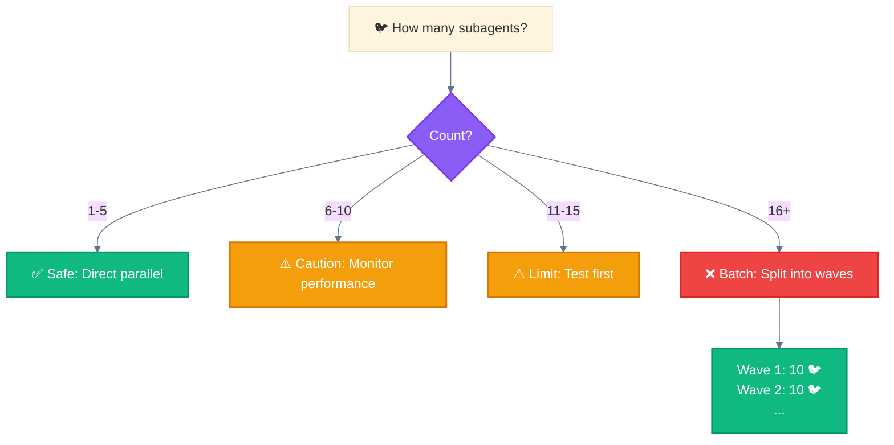
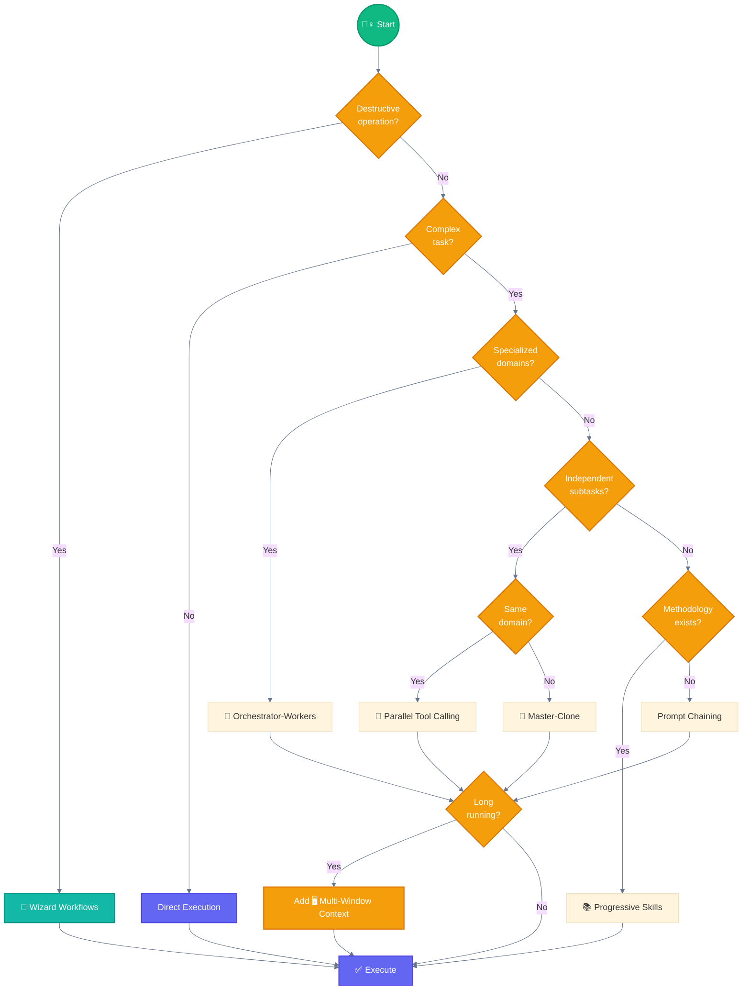

<div align="center">

[🏠 Home](README.md) • [📖 Overview](00-OVERVIEW.md) • **06 Selection Guide**

━━━━━━━━━━━●━━━━━━━━━━━━━━━━━━━━ `6/8`

[← 05 Use Cases](05-USE-CASES.md) • [07 Glossary →](07-MAPPING-GLOSSARY.md)

</div>

---

# System Selection Guide

> Decision trees and criteria for choosing the right workflow or agent

## 📑 Table of Contents

| # | Section | Description |
|---|---------|-------------|
| 1 | [Use Cases → System](#real-world-use-cases--system) | Quick reference |
| 2 | [By Task Complexity](#by-task-complexity) | Complexity-based |
| 3 | [Decision Tree](#master-decision-tree) | Interactive flow |
| 4 | [By Requirement](#system-by-requirement) | Feature matrix |
| 5 | [Combination Rules](#combining-systems) | System combos |

---

## Real-World Use Cases → System

| Use Case | Primary System | Secondary | Details |
|----------|-----------------|-----------|---------|
| Multi-Agent Research | 🦑 Orchestrator-Workers | 🚂 Parallel | [→ Use Cases](05-USE-CASES.md#use-case-1-multi-agent-research-system) |
| Code Review Pipeline | 🚂 Parallel Tool Calling | 🦑 Subagent | [→ Use Cases](05-USE-CASES.md#use-case-2-production-code-review) |
| Multi-Locale Generation | 🧬 Master-Clone | 🧙 Wizard | [→ Use Cases](05-USE-CASES.md#use-case-3-multi-locale-content-generation) |
| Personal Assistant | 📚 Progressive Skills | 🚦 Routing | [→ Use Cases](05-USE-CASES.md#use-case-4-intelligent-personal-assistant) |
| Customer Support | 🚦 Routing | 🦑 Subagent | [→ Use Cases](05-USE-CASES.md#use-case-5-customer-support-automation) |
| Data Migration | 🧙 Wizard Workflows | 🖥️ Multi-Window | [→ Use Cases](05-USE-CASES.md#use-case-6-data-pipeline-migration) |

> See [05-USE-CASES.md](05-USE-CASES.md) for detailed architectures and implementation examples.

---

## Quick Reference

### By Task Complexity

```
Simple Task (1 step)          → Direct execution
Medium Task (2-4 steps)       → Prompt Chaining or 📚 Progressive Skills
Complex Task (5+ steps)       → 🦑 Orchestrator-Workers
Very Complex (multiple hours) → 🧙 Wizard Workflows + 🖥️ Multi-Window Context
```

### By Parallelism Need

```
Sequential required    → Prompt Chaining
Independent steps      → 🚂 Parallel Tool Calling
Independent domains    → 🧬 Master-Clone
Mixed                  → 🦑 Orchestrator-Workers
```

### By User Involvement

```
Fully autonomous       → Autonomous Agents
Occasional feedback    → 🦑 Orchestrator-Workers
Critical checkpoints   → 🧙 Wizard Workflows
Full control           → 🎛️ Programmatic Orchestration
```

---

## Master Decision Tree



---

## Pattern Selection by Scenario

### Scenario 1: Code Review



**Selection:**
- 1-3 files → **Direct execution**
- 4-10 files → **🚂 Parallel Tool Calling** (read all, review)
- 10+ files → **🦑 Orchestrator-Workers** (specialized reviewers)

---

### Scenario 2: Feature Implementation



**Selection:**
- Enforced methodology → **📚 Progressive Skills** first
- Multi-component, independent → **🚂 Parallel Tool Calling**
- Multi-component, dependent → **🦑 Orchestrator-Workers**
- Linear steps → **Prompt Chaining**

---

### Scenario 3: Data Migration



**Selection:**
- Destructive operation → **🧙 Wizard Workflows** (mandatory)
- Long-running → Add **🖥️ Multi-Window Context**
- Multiple tables → Add **🚂 Parallel Tool Calling** for independent tables

---

### Scenario 4: Multi-Locale Generation (AthenaKNW)



**Selection:**
- 🙋‍♀️ User confirmation → **🧙 Wizard Workflows**
- Primary then variants → **🦑 Orchestrator-Workers**
- Variants parallel → **🧬 Master-Clone**
- Long workflow → **🖥️ Multi-Window Context**

---

## Pattern Compatibility Matrix

### Can Be Combined

| Primary System | Compatible With |
|-----------------|-----------------|
| 🧙 Wizard Workflows | All patterns |
| 🦑 Orchestrator-Workers | 🚂 Parallel, 🧬 Master-Clone, 🖥️ Multi-Window |
| 📚 Progressive Skills | 🦑 Subagent, 🚂 Parallel |
| 🚂 Parallel Tool Calling | 🦑 Subagent, 🖥️ Multi-Window |
| 🧬 Master-Clone | 🦑 Subagent, 🖥️ Multi-Window |
| 🖥️ Multi-Window Context | All patterns |
| 🎛️ Programmatic Orchestration | Exclusive (external control) |

### Combination Examples



---

## Anti-Patterns: What NOT to Do

### 1. ❌ Over-Engineering Simple Tasks

```
❌ WRONG: Use 🦑 Orchestrator-Workers for "fix typo"
✅ RIGHT: Direct execution

Rule: If it takes 1 step, don't add patterns
```

### 2. ❌ 🐦 Subagents Spawning 🐦 Subagents

```
❌ WRONG: 🐦 Subagent A spawns 🐦 Subagent B
✅ RIGHT: 🐔 Main Agent spawns both A and B

Rule: Only 🐔 Main Agent can spawn 🐦 subagents
```

### 3. ❌ 🚂 Parallel with Dependencies

```python
❌ WRONG:
[
    Task(prompt="Create schema"),      # Must complete first
    Task(prompt="Insert data")         # Depends on schema
]

✅ RIGHT:
Task(prompt="Create schema")  # Wait for completion
Task(prompt="Insert data")    # Then insert
```

### 4. ❌ 🧙 Wizard for Non-Destructive Tasks

```
❌ WRONG: 🧙 Wizard for "add console.log"
✅ RIGHT: Direct execution

Rule: 🧙 Wizard for destructive/critical operations only
```

### 5. ❌ Skipping 🖥️ Checkpoints in Long Workflows

```
❌ WRONG: 2-hour workflow with no 🖥️ checkpoints
✅ RIGHT: 🖥️ Checkpoint every major phase

Rule: Any workflow > 10 minutes needs 🖥️ Multi-Window Context
```

### 6. ❌ Too Many Parallel 🐦 Subagents

```
❌ WRONG: 39 🐦 subagents in parallel (context overflow)
✅ RIGHT: Batch into waves of 10-15

Rule: Max 10-15 concurrent subagents per wave
```

### 7. ❌ Long Runs Without `/compact`

```
❌ WRONG: 200 files generated without clearing context
✅ RIGHT: /compact between major waves

Rule: Use /compact after 50+ file generations or between major phases
```

---

## Operational Decision Trees

### When to Use `/compact`



**Critical**: Always 🖥️ checkpoint BEFORE `/compact` - context is lost after compaction!

### How Many Parallel 🐦 Subagents



**Recommended limits:**

| Type | Max | Action if exceeded |
|------|-----|-------------------|
| 🐦 Concurrent subagents | 10-15 | Batch into waves |
| 🔌 MCP calls per agent | 5 | Respect rate limits |
| 🪺 Task calls per message | 10 | Split messages |

---

## Selection Flowchart: Complete



---

## Quick Decision Table

| Question | Yes → | No → |
|----------|-------|------|
| Destructive operation? | 🧙 Wizard Workflows | Continue |
| Single step? | Direct Execution | Continue |
| Needs specialization? | 🦑 Orchestrator-Workers | Continue |
| Steps independent? | 🚂 Parallel / 🧬 Master-Clone | Continue |
| Has methodology? | 📚 Progressive Skills | Prompt Chaining |
| Long running? | Add 🖥️ Multi-Window | ✅ Execute |

---

## Pattern Cost/Benefit Analysis

```
┌──────────────────────────┬────────────┬──────────────┬────────────┬────────────┐
│ Pattern                  │ Setup Cost │ Runtime Cost │ Complexity │ Reliability│
├──────────────────────────┼────────────┼──────────────┼────────────┼────────────┤
│ Direct Execution         │ None       │ Low          │ Low        │ High       │
│ Prompt Chaining          │ Low        │ Medium       │ Low        │ High       │
│ 📚 Progressive Skills    │ Medium     │ Low          │ Medium     │ High       │
│ 🚂 Parallel Tool Calling │ Low        │ Medium       │ Low        │ High       │
│ 🦑 Subagent Orchestrate  │ High       │ High         │ High       │ Medium     │
│ 🧬 Master-Clone          │ Medium     │ High         │ Medium     │ High       │
│ 🖥️ Multi-Window Context  │ Medium     │ Low          │ Medium     │ High       │
│ 🧙 Wizard Workflows      │ Medium     │ Low          │ Medium     │ Very High  │
│ 🎛️ Programmatic Orch.    │ High       │ Variable     │ High       │ Very High  │
└──────────────────────────┴────────────┴──────────────┴────────────┴────────────┘
```

---

<div align="center">

**━━━━━━━━━━━━━━━━━━━━━━━━━━━━━━━━━━━━━━━━━━━━━━━━**

[← 05 Use Cases](05-USE-CASES.md) • [🏠 Home](README.md) • [07 Glossary →](07-MAPPING-GLOSSARY.md)

</div>
