<div align="center">

[🏠 Home](README.md) • [📖 Overview](00-OVERVIEW.md) • **07 Glossary**

━━━━━━━━━━━━━━━━━━━━━━━━━━━●━━━ `7/8`

[← 06 Selection Guide](06-SELECTION-GUIDE.md) • [🏠 Home](README.md)

</div>

---

# Mapping & Glossary

> Complete cross-reference of all agentic terminology

## 📑 Table of Contents

| # | Section | Description |
|---|---------|-------------|
| 1 | [Anthropic Official Taxonomy](#anthropic-official-taxonomy) | Workflows vs Agents |
| 2 | [Master Mapping Table](#master-mapping-table) | Components → Layers → Patterns |
| 3 | [Glossary A-Z](#glossary-a-z) | All terms defined |
| 4 | [Built-in Subagents](#built-in-subagents) | General-purpose, Plan, Explore |
| 5 | [Common Confusions](#common-confusions-clarified) | Disambiguation |
| 6 | [Quick Reference](#symbol-key-for-diagrams) | Color codes & symbols |

---

## Anthropic Official Taxonomy

> Source: [Building Effective Agents](https://www.anthropic.com/engineering/building-effective-agents) (December 2024)

```
┌─────────────────────────────────────────────────────────────────────────────┐
│                           AGENTIC SYSTEMS                                   │
│                         (umbrella term)                                     │
├───────────────────┬─────────────────────────────┬───────────────────────────┤
│     BASELINE      │          WORKFLOWS          │         AGENTS            │
│   Single LLM      │  LLMs orchestrated through  │ LLMs dynamically direct   │
│   augmented call  │    PREDEFINED code paths    │   their OWN processes     │
├───────────────────┼─────────────────────────────┼───────────────────────────┤
│ 0. 🏎️ Direct      │ 1. ⛓️ Prompt Chaining       │ 6. 🐉 Autonomous Agents   │
│    Execution      │ 2. 🚦 Routing               │                           │
│                   │ 3. 🛤️ Parallelization       │                           │
│                   │    ├─ Sectioning            │                           │
│                   │    └─ Voting                │                           │
│                   │ 4. 🦑 Orchestrator-Workers  │                           │
│                   │ 5. 🩻 Evaluator-Optimizer   │                           │
└───────────────────┴─────────────────────────────┴───────────────────────────┘
```

### Building Block: Augmented LLM

```
┌────────────────────────────────────────────────────────────┐
│                    AUGMENTED LLM                           │
│              (foundation for all patterns)                 │
├───────────────┬───────────────┬───────────────┬────────────┤
│   Retrieval   │    Tools      │    Memory     │    LLM     │
│   (RAG/docs)  │  (actions)    │  (context)    │   (core)   │
└───────────────┴───────────────┴───────────────┴────────────┘
```

### Key Distinction

| Aspect | Workflows | Agents |
|--------|-----------|--------|
| **Control** | Predefined code paths | Dynamic self-direction |
| **Predictability** | High, deterministic | Lower, adaptive |
| **When to use** | Clear task decomposition | Complex unknown territory |
| **Claude Code** | Prompt Chaining, Skills, Hooks | Multi-Window Context |

---

## Master Mapping Table

### Components → Layers → Patterns

```
┌─────────────────┬──────────────────┬─────────────────────────────────────────┐
│ Component       │ Layer            │ Patterns Used In                        │
├─────────────────┼──────────────────┼─────────────────────────────────────────┤
│ Main Agent      │ Main Agent Layer │ All patterns (orchestrator)             │
│ Subagent        │ Execution Layer  │ Subagent Orchestration, Master-Clone    │
│ Slash Command   │ Delegation Layer │ Wizard Workflows, All entry points      │
│ Skill           │ Delegation Layer │ Progressive Skills                      │
│ Hook            │ State Layer      │ Programmatic Orchestration              │
│ Task (🪺 spawn) │ Execution Layer  │ Subagent Orchestration, Master-Clone    │
│ AskUserQuestion │ User Layer       │ Wizard Workflows                        │
│ Tools (Read,..) │ Execution Layer  │ All patterns                            │
└─────────────────┴──────────────────┴─────────────────────────────────────────┘
```

### Anthropic Research → Claude Code Implementation

```
┌─────────────────────────────────────────────────────────────────────────────────┐
│                              WORKFLOWS (Predefined)                             │
├───────────────────────┬──────────────────────────┬──────────────────────────────┤
│ Anthropic Pattern     │ Claude Code Pattern      │ Key Component                │
├───────────────────────┼──────────────────────────┼──────────────────────────────┤
│ ⛓️ Prompt Chaining    │ Prompt Chaining          │ Sequential tool calls        │
│                       │ 🎛️ Programmatic Orchestr.│ External code control        │
├───────────────────────┼──────────────────────────┼──────────────────────────────┤
│ 🚦 Routing            │ 📚 Progressive Skills    │ Skill loading                │
├───────────────────────┼──────────────────────────┼──────────────────────────────┤
│ 🛤️ Parallelization    │ 🚂 Parallel Tool Calling │ Multiple tools/message       │
│   ├─ Sectioning       │ 🧬 Master-Clone          │ Isolated subagents           │
│   └─ Voting           │ (consensus patterns)     │ Multi-result comparison      │
├───────────────────────┼──────────────────────────┼──────────────────────────────┤
│ 🦑 Orchestrator-Workers│ Subagent Orchestration   │ Task + agents/*.md           │
├───────────────────────┼──────────────────────────┼──────────────────────────────┤
│ 🩻 Evaluator-Optimizer │ (Loop with validation)   │ Iterative tool calls         │
├───────────────────────┼──────────────────────────┼──────────────────────────────┤
│ 🧙 Human-in-the-Loop  │ Wizard Workflows         │ AskUserQuestion tool         │
├─────────────────────────────────────────────────────────────────────────────────┤
│                              AGENTS (Dynamic)                                   │
├───────────────────────┬──────────────────────────┬──────────────────────────────┤
│ 🐉 Autonomous Agents  │ 🖥️ Multi-Window Context  │ Checkpointing, self-direction│
└───────────────────────┴──────────────────────────┴──────────────────────────────┘
```

---

## Glossary: A-Z

### A

**ACI (Agent-Computer Interface)**
: The design layer between AI agents and computer tools. Coined by Anthropic, emphasizing that tool interfaces should be optimized for agent ergonomics (clear documentation, error handling, output structure) not just human usability (HCI).
: *Also known as:* Tool Interface, Agent Tooling Layer

**Agent**
: ⚠️ **Ambiguous term** — can mean:
: 1. **Generic:** Any autonomous AI system (Main Agent, Subagent)
: 2. **Anthropic Pattern #6:** System where LLMs **dynamically direct their own processes** (🐉 Autonomous Agents)
: In Claude Code, the 🐔 Main Agent orchestrates all operations. Contrast Agents (pattern) with Workflows.
: *See also:* Main Agent, Subagent, 🐉 Autonomous Agent

**Agentic Systems**
: Umbrella term for any system using LLMs with tool-calling and control flow. Encompasses both Workflows (predefined orchestration) and Agents (dynamic direction).
: *Also known as:* Agentic Architecture, Autonomous Systems

**AskUserQuestion**
: Tool for human-in-the-loop interactions. Presents structured questions with options to the user. Key component of Wizard Workflows.

```python
AskUserQuestion(questions=[{
    "header": "Confirm",
    "question": "Proceed with migration?",
    "options": [
        {"label": "Yes", "description": "Continue"},
        {"label": "No", "description": "Cancel"}
    ]
}])
```

**🐉 Autonomous Agent**
: An agent that independently plans, executes, and adapts without constant human guidance. The only true "Agent" pattern in Anthropic's taxonomy (vs Workflows).
: *Also known as:* Self-Directed Agent, True Agent

**Augmented LLM**
: The 🧱 Building Block — foundation for all agentic systems. An LLM enhanced with retrieval (RAG/docs), tools (actions), and memory (context persistence).
: *Also known as:* 🧱 Building Block, Enhanced LLM, Tooled LLM
: *See also:* Building Block

### B

**🧱 Building Block**
: Anthropic's term for the **Augmented LLM** — the foundational unit of all agentic systems. An LLM enhanced with retrieval, tools, and memory.
: ⚠️ **Not to be confused with:** Claude Code Components (Subagent, Slash Command, Skill, Hook) which are abstractions built ON TOP of the building block.
: *See also:* Augmented LLM

**Built-in Subagents**
: Pre-configured subagents available out of the box in Claude Code. See [Built-in Subagents](#built-in-subagents) section.

### C

**Checkpointing**
: Saving workflow state to enable resume after interruption. Key mechanism of Multi-Window Context pattern.

**CLAUDE.md**
: Project instruction file loaded automatically by Claude Code. Part of the State Layer.

**Component**
: Claude Code abstractions for organizing agent capabilities: 🐦 Subagent, 🦴 Slash Command, 📚 Skill, 🪝 Hook.
: ⚠️ **Not to be confused with:** 🧱 Building Block (Anthropic's Augmented LLM concept).

**Context Management**
: Automatic compaction and context management to ensure agents don't run out of context. Core capability of Claude Agent SDK.

### D

**Delegation Layer**
: Layer 3 in the architecture. Contains Slash Commands and Skills that define workflows and capabilities.

**🏎️ Direct Execution (Baseline)**
: The foundation - single augmented LLM call with no orchestration. Pattern #0 in our taxonomy. Fastest execution path.

### E

**🩻 Evaluator-Optimizer**
: Anthropic pattern for iterative improvement through generate-evaluate-feedback loops.

**Execution Layer**
: Layer 4 in the architecture. Where Subagents and Tools perform actual work.

### H

**Hook**
: Shell command or prompt triggered by Claude Code events. Types: `command` (shell) or `prompt` (LLM-based).

```json
{
  "hooks": {
    "PostToolUse": [{
      "matcher": "Write",
      "hooks": [{ "type": "command", "command": "npm run lint" }]
    }]
  }
}
```

**Human-in-the-Loop**
: Design pattern where human approval/input is required at key points. Implemented via AskUserQuestion in Wizard Workflows.

**Hook Events**
: Lifecycle events that trigger hooks. Official events: `PreToolUse`, `PostToolUse`, `PermissionRequest`, `UserPromptSubmit`, `Stop`, `SubagentStop`, `PreCompact`, `SessionStart`, `SessionEnd`, `Notification`.

### L

**Layer**
: One of 5 architectural levels: User, Main Agent, Delegation, Execution, State.

### M

**Main Agent**
: The central Claude Code agent that orchestrates all operations. Only entity that can spawn Subagents.

**Main Agent Layer**
: Layer 2 in the architecture. The orchestration center.

**🧬 Master-Clone**
: Claude Code pattern for spawning multiple isolated subagents handling independent domains. Variant of 🛤️ Parallelization.

**Model-invoked**
: Capability (like Skills) that Claude autonomously decides when to use based on context. Contrast with User-invoked (Slash Commands).

**🖥️ Multi-Window Context**
: Claude Code pattern for checkpointing and resuming long workflows. Implementation of 🐉 Autonomous Agents.

### O

**Orchestrator**
: The coordinating entity in Orchestrator-Workers pattern. In Claude Code, this is the Main Agent.

**Orchestrator-Workers**
: Anthropic pattern where a central orchestrator delegates to specialized workers.

### P

**🚂 Parallel Tool Calling**
: Claude Code pattern for executing multiple independent tool calls in a single message. Variant of 🛤️ Parallelization.

```python
# Single message, parallel execution
[
    Read(file_path="file1.ts"),
    Read(file_path="file2.ts"),
    Grep(pattern="TODO")
]
```

**🛤️ Parallelization**
: Anthropic pattern for executing independent tasks simultaneously.

**Pattern**
: A reusable solution to a common agentic system design problem.

**Permission Modes**
: Subagent tool permission control. Values: `default`, `acceptEdits`, `bypassPermissions`, `plan`, `ignore`.

| Mode | Behavior |
|------|----------|
| `default` | Asks permission for each tool |
| `acceptEdits` | Auto-approves Write/Edit |
| `bypassPermissions` | All tools auto-approved |
| `plan` | Read-only planning mode |
| `ignore` | Skip permission prompts |

**📚 Progressive Skills**
: Claude Code mechanism for loading capabilities on-demand based on task context. Implementation of 🚦 Routing.

**🎛️ Programmatic Orchestration**
: Claude Code mechanism where external code (Agent SDK) controls agent invocation and workflow.

**⛓️ Prompt Chaining**
: Anthropic pattern for sequential execution where each step feeds the next.

**Prompt-based Hook**
: Hook using `type: "prompt"` for LLM evaluation (via Haiku) instead of bash command. Supports context-aware decisions.

### R

**🚦 Routing**
: Anthropic pattern for directing inputs to specialized handlers based on classification.

**Resumable Subagents**
: Subagents that can be resumed via `resume` parameter to continue previous conversations using their `agentId`.

```python
# Resume with previous context
Task(
    subagent_type="code-analyzer",
    prompt="Now analyze authorization logic",
    resume="abc123"  # agentId from previous execution
)
```

### S

**Sectioning**
: Sub-variant of 🛤️ Parallelization where tasks are split into independent subtasks processed concurrently. Focus on task decomposition.
: *Also known as:* Task Splitting, Parallel Decomposition
: *Claude Code:* Parallel Tool Calling, Master-Clone

**Session Management**
: Resume and fork capabilities for maintaining conversation context across sessions. Core feature of Claude Agent SDK.

**📚 Skill**
: Reusable methodology/capability that enhances agent behavior. Model-invoked (Claude decides when to use). Located in `.claude/skills/*/SKILL.md`.

```bash
.claude/skills/test-driven-development/
└── SKILL.md   # Contains description + instructions
```

> Skill name from directory name. Frontmatter: `name` (optional, max 64 chars), `description` (required, max 1024 chars), `allowed-tools` (optional, restricts tool access).

**Slash Command**
: User-invokable workflow starting with `/`. Located in `.claude/commands/*.md`.

```markdown
# .claude/commands/generate.md
---
description: Generate localization files
argument-hint: [locale]
---
```

> Command name from filename. Supported: `description`, `argument-hint`, `allowed-tools`, `model`, `disable-model-invocation`.

**State Layer**
: Layer 5 in the architecture. Handles persistence, memory, and context.

**Subagent**
: Specialized agent 🪺 spawned via Task tool. Cannot spawn other subagents. Located in `.claude/agents/*.md`.

```markdown
# .claude/agents/reviewer.md
---
name: code-reviewer
description: Expert code review specialist
tools: Read, Grep, Glob
---
```

> `tools` is a comma-separated string. `description` is required.

**🦑 Subagent Orchestration**
: Claude Code pattern where Main Agent spawns specialized Subagents. Implementation of Orchestrator-Workers.

### T

**Task tool (🪺 spawn)**
: The mechanism for 🪺 spawning Subagents.

```python
Task(
    subagent_type="code-reviewer",
    prompt="Review auth module"
)
```

**TodoWrite**
: Tool for task tracking and progress visibility.

**Tool**
: Executable capability (Read, Write, Bash, Grep, etc.) available to agents.

### U

**User Layer**
: Layer 1 in the architecture. Entry point for all human interactions.

**User-invoked**
: Capability explicitly triggered by user (like Slash Commands with `/`). Contrast with Model-invoked (Skills).

### V

**Voting**
: Sub-variant of 🛤️ Parallelization where multiple instances run the same task and a consensus mechanism selects the best result. Focus on quality/reliability.
: *Also known as:* Consensus Mechanism, Redundant Execution
: *Use case:* Critical decisions, validation, diverse perspectives

### W

**🧙 Wizard Workflows**
: Claude Code pattern for multi-step processes with explicit user confirmation at each phase. Implementation of Human-in-the-Loop.

**Worker**
: Specialized executor in Orchestrator-Workers pattern. In Claude Code, these are Subagents.

**Workflow**
: Anthropic official term for agentic systems where LLMs are orchestrated through **predefined code paths**. Includes 5 patterns: Prompt Chaining, Routing, Parallelization, Orchestrator-Workers, Evaluator-Optimizer.
: *Contrast with:* Agent (dynamic self-direction)
: *Also known as:* Orchestration Pattern, Predefined Pipeline

---

## Visual Glossary

### Component Hierarchy

```mermaid
%%{init: {'theme': 'base', 'themeVariables': {'lineColor': '#64748b'}}}%%
flowchart TB
    classDef main fill:#8b5cf6,stroke:#7c3aed,stroke-width:2px,color:#ffffff
    classDef subagent fill:#ec4899,stroke:#db2777,stroke-width:2px,color:#ffffff
    classDef user fill:#6366f1,stroke:#4f46e5,stroke-width:2px,color:#ffffff
    classDef skill fill:#8b5cf6,stroke:#7c3aed,stroke-width:2px,color:#ffffff

    subgraph Components
        MA["🐔 Main Agent"]:::main
        SA["🐦 Subagent"]:::subagent
        CMD["🦴 Slash Command"]:::user
        SKILL["📚 Skill"]:::skill
        HOOK["🪝 Hook"]:::main
    end

    MA -->|"🪺 spawns via Task"| SA
    CMD -->|triggers| MA
    SKILL -->|enhances| MA
    HOOK -->|automates| MA
```



### Pattern Relationships

```mermaid
%%{init: {'theme': 'base', 'themeVariables': {'lineColor': '#64748b'}}}%%
flowchart LR
    subgraph Research["Anthropic Research (0: Baseline + 1-5: Workflows + 6: Agent)"]
        R0[🏎️ Baseline]
        R1[⛓️ Prompt Chaining]
        R2[🚦 Routing]
        R3[🛤️ Parallelization]
        R4[🦑 Orchestrator-Workers]
        R5[🩻 Evaluator-Optimizer]
        R6[🐉 Autonomous Agents]
    end

    subgraph Implementation["Claude Code (7)"]
        I1[Subagent Orchestration]
        I2[Progressive Skills]
        I3[Parallel Tool Calling]
        I4[Master-Clone]
        I5[Multi-Window Context]
        I6[🎛️ Programmatic Orchestration]
        I7[Wizard Workflows]
    end

    R4 --> I1
    R2 --> I2
    R3 --> I3
    R3 --> I4
    R6 --> I5
    R1 --> I6
    R1 --> I7
```



### Layer Interactions

```mermaid
%%{init: {'theme': 'base', 'themeVariables': {'lineColor': '#64748b'}}}%%
flowchart TB
    classDef user fill:#6366f1,stroke:#4f46e5,stroke-width:2px,color:#ffffff
    classDef main fill:#8b5cf6,stroke:#7c3aed,stroke-width:2px,color:#ffffff
    classDef subagent fill:#ec4899,stroke:#db2777,stroke-width:2px,color:#ffffff
    classDef tool fill:#f59e0b,stroke:#d97706,stroke-width:2px,color:#ffffff
    classDef state fill:#10b981,stroke:#059669,stroke-width:2px,color:#ffffff

    L1["🙋‍♀️ Layer 1: User"]:::user --> L2["🐔 Layer 2: Main Agent"]:::main
    L2 --> L3["🔀 Layer 3: Delegation"]:::subagent
    L3 --> L4["⚡ Layer 4: Execution"]:::tool
    L4 --> L5["💾 Layer 5: State"]:::state
    L5 -.-> L2
```



---

## Built-in Subagents

Claude Code includes pre-configured subagents available out of the box:

| Subagent | Model | Tools | Purpose |
|----------|-------|-------|---------|
| **General-purpose** | Sonnet | All tools | Complex multi-step tasks requiring exploration and action |
| **Plan** | Sonnet | Read, Glob, Grep, Bash | Research in plan mode (read-only exploration) |
| **Explore** | Haiku | Glob, Grep, Read, Bash (read-only) | Fast codebase searching and analysis |

### General-purpose Subagent

Used when tasks require both exploration and modification. Handles:
- Complex reasoning to interpret search results
- Multiple strategies if initial searches fail
- Multi-step operations with dependencies

### Plan Subagent

Specialized for plan mode research. Automatically invoked when Claude needs to understand codebase before creating a plan. Prevents infinite nesting (subagents cannot spawn other subagents).

### Explore Subagent

Fast, lightweight agent optimized for read-only codebase exploration. Thoroughness levels:

| Level | Use Case |
|-------|----------|
| `quick` | Basic searches, simple lookups |
| `medium` | Moderate exploration, balanced speed/thoroughness |
| `very thorough` | Comprehensive analysis, unexpected locations |

```
User: "Where are errors from the client handled?"

Claude: [Invokes Explore subagent with "medium" thoroughness]
→ Searches for error handling patterns
→ Examines promising files
→ Returns: "Client errors are handled in src/services/process.ts:712..."
```

---

## Common Confusions Clarified

### Command vs Slash Command

| Term | Meaning |
|------|---------|
| **Command** | Generic term for any instruction |
| **Slash Command** | Specific Claude Code component starting with `/` |

**Use "Slash Command" when referring to `.claude/commands/*.md` files.**

### Agent vs Subagent

| Term | Meaning |
|------|---------|
| **Agent** | Any autonomous AI system |
| **Main Agent** | The primary Claude Code instance |
| **Subagent** | Agent 🪺 spawned by Main Agent via Task |

**Subagents cannot spawn other Subagents.**

### Workflow vs Agent (Anthropic Official)

| Term | Anthropic Definition | Control |
|------|---------------------|---------|
| **Workflow** | LLMs orchestrated through **predefined** code paths | Code-directed |
| **Agent** | LLMs **dynamically direct** their own processes | Self-directed |

**Baseline:** Direct Execution (pattern #0)
**5 Workflow patterns:** Prompt Chaining, Routing, Parallelization, Orchestrator-Workers, Evaluator-Optimizer
**1 Agent pattern:** Autonomous Agents (pattern #6)

> "Pattern" is a generic software term we use for both. Anthropic uses "Workflow" and "Agent" as the primary taxonomy.

**Example**: Progressive Skills routing = *Workflow* (predefined skill selection); Multi-Window autonomous exploration = *Agent* (self-directed).

### Skill vs Tool

| Term | Meaning |
|------|---------|
| **Skill** | Methodology/knowledge loaded for specific tasks |
| **Tool** | Executable action (Read, Write, Bash, etc.) |

**Skills enhance how tools are used; tools are the actual operations.**

---

## File Location Reference

```
.claude/
├── agents/                    # Subagent definitions
│   └── *.md                   # One file per subagent type
├── commands/                  # Slash Command definitions
│   └── *.md                   # One file per command (name from filename)
├── skills/                    # Skill definitions
│   └── skill-name/            # One directory per skill (name from dir)
│       └── SKILL.md           # Skill content
└── settings.json              # Hooks and configuration
```

---

## Symbol Key (for Diagrams)

| Symbol | Meaning |
|--------|---------|
| `[Rectangle]` | Process/Component |
| `{Diamond}` | Decision point |
| `((Circle))` | Start/End |
| `-->` | Sequential flow |
| `-.->` | Optional/async flow |
| `-->│` | Parallel flow |

### Color Coding

| Color | Hex | Meaning | Emoji |
|-------|-----|---------|-------|
| Indigo | `#6366f1` | User, Slash Commands | 🙆‍♀️ 🙋‍♀️ 💁‍♀️ 🦴 |
| Purple | `#8b5cf6` | Main Agent, Skills | 🐔 📚 |
| Pink | `#ec4899` | Subagent | 🐦 🦑 |
| Amber | `#f59e0b` | MCP Tools, Warning | 🔌 ⚠️ |
| Emerald | `#10b981` | State, Success, Hook | 💾 ✅ 🪝 |
| Blue | `#3b82f6` | Parallel, Multi-Window | 🛤️ 🚂 🖥️ 🧬 |
| Teal | `#14b8a6` | Wizard | 🧙 |
| Red | `#ef4444` | Error | ❌ |
| Slate | `#64748b` | Neutral, Skip, Built-in | ⏭️ 🔧 🏎️ |

### Pattern Emoji Reference

| Emoji | Pattern | Type |
|-------|---------|------|
| 🏎️ | Direct Execution | Baseline (#0) |
| ⛓️ | Prompt Chaining | Workflow (#1) |
| 🚦 | Routing | Workflow (#2) |
| 🛤️ | Parallelization | Workflow (#3) |
| 🦑 | Subagent Orchestration | Workflow (#4) |
| 🩻 | Evaluator-Optimizer | Workflow (#5) |
| 🐉 | Autonomous Agents | Agent (#6) |
| 🧙 | Wizard Workflows | Variant |
| 🚂 | Parallel Tool Calling | Variant |
| 🧬 | Master-Clone | Variant |
| 🖥️ | Multi-Window Context | Variant |
| 📚 | Progressive Skills | Mechanism |
| 🎛️ | Programmatic Orchestration | Mechanism |

---

<div align="center">

**━━━━━━━━━━━━━━━━━━━━━━━━━━━━━━━━━━━━━━━━━━━━━━━━**

[← 06 Selection Guide](06-SELECTION-GUIDE.md) • [🏠 Home](README.md)

</div>
