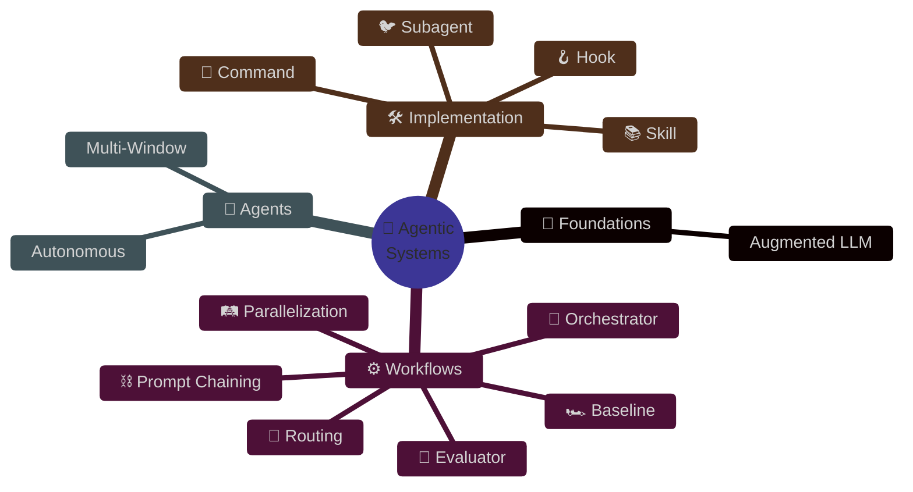
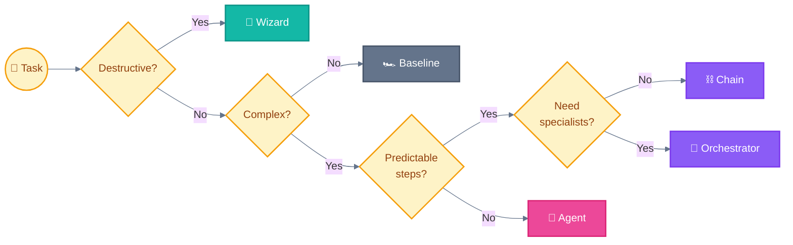
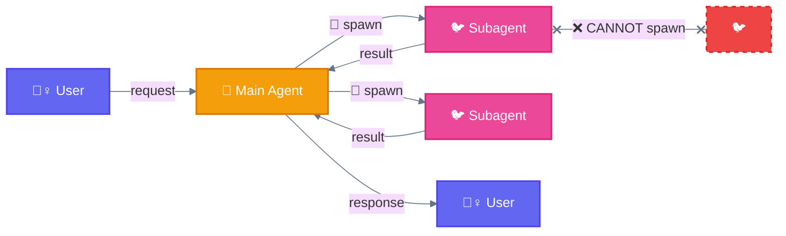

<div align="center">

# Agentic AI Systems 🐔

**Workflows and agents for building agentic AI systems | Explained simply**

<sub>Mermaid diagrams 📊 • Clear examples 💡 • Chicken metaphors 🐔🐦<br/>
Because complex systems deserve simple explanations.</sub>

<br/>

<a href="https://docs.anthropic.com/en/docs/claude-code">
  
</a>
<a href="https://www.anthropic.com/research/building-effective-agents">
  
</a>
<a href="https://github.com/hesreallyhim/awesome-claude-code">
  
</a>

</div>

---

## Overview



---

## 🗺️ Navigation

<table>
<tr>
<td width="50%" valign="top">

### 🧱 [Foundations](foundations/)
*The building block for everything*

| | |
|---|---|
| [🧱 Augmented LLM](foundations/augmented-llm.md) | LLM + Retrieval + Tools + Memory |

---

### ⚙️ [Workflows](workflows/)
*Predefined orchestration — code controls the flow*

| # | Workflow | Use When |
|:-:|----------|----------|
| 0 | [🏎️ Baseline](workflows/00-baseline.md) | Simple, 1-step task |
| 1 | [⛓️ Prompt Chaining](workflows/01-prompt-chaining.md) | Sequential steps |
| 2 | [🚦 Routing](workflows/02-routing.md) | Classify & dispatch |
| 3 | [🛤️ Parallelization](workflows/03-parallelization.md) | Independent tasks |
| 4 | [🦑 Orchestrator](workflows/04-orchestrator-workers.md) | Expert delegation |
| 5 | [🩻 Evaluator](workflows/05-evaluator-optimizer.md) | Quality iteration |

</td>
<td width="50%" valign="top">

### 🐉 [Agents](agents/)
*Dynamic autonomy — LLM controls the flow*

| Agent | Use When |
|-------|----------|
| [🐉 Autonomous](agents/autonomous.md) | Open-ended problems |
| [🖥️ Multi-Window](agents/multi-window.md) | Cross-session state |

---

### 🛠️ [Implementation](implementation/)
*Claude Code components & architecture*

| Component | Location |
|-----------|----------|
| [🐦 Subagent](implementation/components/subagent.md) | `.claude/agents/*.md` |
| [🦴 Command](implementation/components/slash-command.md) | `.claude/commands/*.md` |
| [📚 Skill](implementation/components/skill.md) | `.claude/skills/*/SKILL.md` |
| [🪝 Hook](implementation/components/hook.md) | `.claude/settings.json` |

---

### 🗺️ [Guides](guides/) & [📖 Reference](reference/)

| Resource | Description |
|----------|-------------|
| [Selection Guide](guides/README.md) | Choose the right pattern |
| [Use Cases](guides/use-cases/) | 6 validated examples |
| [Glossary](reference/glossary.md) | A-Z definitions |
| [Visual Standards](reference/visual-standards.md) | Colors & emojis |

</td>
</tr>
</table>

---

## Quick Decision



| Situation | → Use |
|-----------|-------|
| Simple task (1 step) | 🏎️ Baseline |
| Sequential (2-4 steps) | ⛓️ Prompt Chaining |
| Categorize inputs | 🚦 Routing |
| Independent subtasks | 🛤️ Parallelization |
| Multiple specialists | 🦑 Orchestrator-Workers |
| Quality iteration | 🩻 Evaluator-Optimizer |
| Open-ended / unknown steps | 🐉 Autonomous Agent |
| Destructive operations | 🧙 Wizard (human checkpoints) |
| Long-running (>10 min) | 🖥️ Multi-Window Context |

---

## Anthropic Taxonomy

```mermaid
%%{init: {'theme': 'base', 'themeVariables': {'lineColor': '#64748b'}}}%%
flowchart LR
    subgraph WORKFLOWS["⚙️ WORKFLOWS"]
        direction TB
        W1[🏎️ Baseline]
        W2[⛓️ Prompt Chaining]
        W3[🚦 Routing]
        W4[🛤️ Parallelization]
        W5[🦑 Orchestrator]
        W6[🩻 Evaluator]
    end

    subgraph AGENTS["🐉 AGENTS"]
        direction TB
        A1[🐉 Autonomous]
        A2[🖥️ Multi-Window]
    end

    CODE[📝 Code controls] --> WORKFLOWS
    WORKFLOWS --> LLM[🧠 LLM controls]
    LLM --> AGENTS

    classDef workflowBox fill:#ede9fe,stroke:#8b5cf6,stroke-width:2px,color:#5b21b6
    classDef agentBox fill:#fce7f3,stroke:#ec4899,stroke-width:2px,color:#9d174d
    classDef control fill:#f1f5f9,stroke:#64748b,stroke-width:1px,color:#475569

    WORKFLOWS:::workflowBox
    AGENTS:::agentBox
    CODE:::control
    LLM:::control
```



> **Key distinction:** Workflows have predefined paths (code controls). Agents decide their own path (LLM controls).

---

## Critical Rule



> **🐦 Subagents cannot spawn other 🐦 subagents.** All delegation flows through 🐔 Main Agent.

---

## Repository Structure

```
.
├── README.md                      # 🏠 You are here
│
├── foundations/                   # 🧱 Core concepts
│   └── augmented-llm.md
│
├── workflows/                     # ⚙️ Predefined orchestration
│   ├── 00-baseline.md
│   ├── 01-prompt-chaining.md
│   ├── 02-routing.md
│   ├── 03-parallelization.md
│   ├── 04-orchestrator-workers.md
│   └── 05-evaluator-optimizer.md
│
├── agents/                        # 🐉 Autonomous systems
│   ├── autonomous.md
│   └── multi-window.md
│
├── implementation/                # 🛠️ Claude Code specifics
│   ├── components/                # 🐦🦴📚🪝
│   └── architecture/              # 5-layer system
│
├── guides/                        # 🗺️ Selection & use cases
│   └── use-cases/                 # 6 validated examples
│
└── reference/                     # 📖 Glossary, standards
```

---

## References

| Resource | Link |
|----------|------|
| Building Effective Agents | [anthropic.com/engineering](https://www.anthropic.com/engineering/building-effective-agents) |
| Claude Code Docs | [docs.anthropic.com](https://docs.anthropic.com/en/docs/claude-code) |
| Agent SDK | [docs.anthropic.com/agent-sdk](https://docs.anthropic.com/docs/en/agent-sdk) |
| Anthropic Cookbook | [github.com/anthropics](https://github.com/anthropics/anthropic-cookbook) |

---

## Contributing

Contributions welcome! See [CONTRIBUTING.md](CONTRIBUTING.md).

**Requirements:** Official sources • Code examples • Mermaid diagrams • Established format

---

<div align="center">

<sub>Built with Claude Code | Based on Anthropic documentation | 2025</sub><br/>
<sub>Independent community resource — not affiliated with Anthropic</sub>

<br/>

<a href="https://github.com/ThibautMelen">
  
</a>
&nbsp;❤️&nbsp;
<a href="https://github.com/SuperNovae-studio">
  
</a>
&nbsp;🏴‍☠️

</div>
