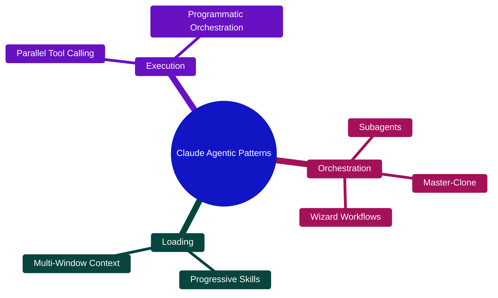

<h1 align="center">Agentic Patterns</h1>

<p align="center">
  <strong>Design patterns for building agentic AI systems</strong>
</p>

<p align="center">
  <em>Curated collection of validated orchestration patterns from official documentation and research</em>
</p>

<p align="center">
  <sub>⚠️ <strong>Disclaimer:</strong> This is an independent community resource. Not affiliated with Anthropic.</sub><br/>
  <sub>Patterns are based on official documentation but maintained independently.</sub>
</p>

<p align="center">
  <a href="#patterns">Patterns</a> •
  <a href="#quick-start">Quick Start</a> •
  <a href="#architecture">Architecture</a> •
  <a href="#references">References</a> •
  <a href="#contributing">Contributing</a>
</p>

<p align="center">
  
  
  
  
</p>

---

## Why This Repository?

Building effective AI agents requires proven architectural patterns. This repository distills **official Anthropic documentation** and **engineering blog posts** into actionable design patterns with:

- **Mermaid diagrams** for visual understanding
- **Code examples** ready for implementation
- **Decision guides** for pattern selection
- **Best practices** from Anthropic engineers

> All patterns are sourced from official Anthropic resources and validated against Claude Code, Agent SDK, and API documentation.

---

## Overview



---

## Patterns

| # | Pattern | Description | Complexity | Source |
|---|---------|-------------|------------|--------|
| 01 | [**Subagent Orchestration**](patterns/01-subagent-orchestration.md) | Delegate to specialized agents with isolated context | Medium | [Docs](https://code.claude.com/docs/en/sub-agents) |
| 02 | [**Progressive Skills**](patterns/02-progressive-skills.md) | On-demand loading of modular capabilities | Medium | [Blog](https://www.anthropic.com/engineering/equipping-agents-for-the-real-world-with-agent-skills) |
| 03 | [**Parallel Tool Calling**](patterns/03-parallel-tool-calling.md) | Maximize performance with simultaneous execution | Low | [Docs](https://docs.anthropic.com/docs/en/build-with-claude/prompt-engineering/claude-4-best-practices) |
| 04 | [**Master-Clone Architecture**](patterns/04-master-clone-architecture.md) | Dynamic self-spawning for flexible delegation | High | [Blog](https://blog.sshh.io/p/how-i-use-every-claude-code-feature) |
| 05 | [**Multi-Window Context**](patterns/05-multi-window-context.md) | State persistence across context windows | High | [Docs](https://docs.anthropic.com/docs/en/build-with-claude/context-windows) |
| 06 | [**Programmatic Orchestration**](patterns/06-programmatic-orchestration.md) | Code-based tool orchestration | Medium | [Blog](https://www.anthropic.com/engineering/advanced-tool-use) |
| 07 | [**Wizard Workflows**](patterns/07-wizard-workflows.md) | Multi-step processes with user confirmation | Medium | [Docs](https://code.claude.com/docs/en/common-workflows) |

---

## Quick Start

### Pattern Selection Guide

```mermaid
%%{init: {'theme': 'base', 'themeVariables': { 'primaryColor': '#8b5cf6', 'primaryTextColor': '#ffffff', 'primaryBorderColor': '#7c3aed', 'lineColor': '#a78bfa', 'secondaryColor': '#f472b6', 'tertiaryColor': '#2dd4bf', 'background': '#0f172a', 'mainBkg': '#1e1b4b', 'nodeBorder': '#a78bfa', 'clusterBkg': '#1e1b4b', 'titleColor': '#f8fafc', 'edgeLabelBackground': '#1e1b4b'}}}%%
flowchart TD
    Start([🎯 Task Type?]):::startNode --> Q1{🧠 Need specialized<br/>expertise?}:::questionNode

    Q1 -->|Yes| Q2{📋 Fixed or<br/>dynamic?}:::questionNode
    Q1 -->|No| Q3{⚡ Multiple<br/>operations?}:::questionNode

    Q2 -->|Fixed workflows| P1[🤖 01: Subagent Orchestration]:::patternNode1
    Q2 -->|Dynamic needs| P4[🧬 04: Master-Clone]:::patternNode4

    Q3 -->|Yes, independent| P3[⚡ 03: Parallel Tool Calling]:::patternNode3
    Q3 -->|Yes, dependent| Q4{🔧 Complex logic?}:::questionNode
    Q3 -->|No| Direct[✅ Direct execution]:::directNode

    Q4 -->|Yes| P6[💻 06: Programmatic Orchestration]:::patternNode6
    Q4 -->|No| Sequential[📝 Sequential calls]:::directNode

    Start --> Q5{⏰ Long-running<br/>task?}:::questionNode
    Q5 -->|Yes| P5[🪟 05: Multi-Window Context]:::patternNode5

    Start --> Q6{👤 User approval<br/>needed?}:::questionNode
    Q6 -->|Yes| P7[🧙 07: Wizard Workflows]:::patternNode7

    Start --> Q7{📦 Modular<br/>capabilities?}:::questionNode
    Q7 -->|Yes| P2[🎯 02: Progressive Skills]:::patternNode2

    classDef startNode fill:#6366f1,stroke:#4f46e5,stroke-width:3px,color:#ffffff
    classDef questionNode fill:#8b5cf6,stroke:#7c3aed,stroke-width:2px,color:#ffffff
    classDef patternNode1 fill:#ec4899,stroke:#db2777,stroke-width:2px,color:#ffffff
    classDef patternNode2 fill:#14b8a6,stroke:#0d9488,stroke-width:2px,color:#ffffff
    classDef patternNode3 fill:#f59e0b,stroke:#d97706,stroke-width:2px,color:#ffffff
    classDef patternNode4 fill:#ef4444,stroke:#dc2626,stroke-width:2px,color:#ffffff
    classDef patternNode5 fill:#3b82f6,stroke:#2563eb,stroke-width:2px,color:#ffffff
    classDef patternNode6 fill:#10b981,stroke:#059669,stroke-width:2px,color:#ffffff
    classDef patternNode7 fill:#f472b6,stroke:#ec4899,stroke-width:2px,color:#ffffff
    classDef directNode fill:#64748b,stroke:#475569,stroke-width:2px,color:#ffffff
```



### By Use Case

| Use Case | Recommended Pattern(s) | Why |
|----------|----------------------|-----|
| Code review automation | Subagents + Parallel Tools | Specialized reviewers + concurrent file analysis |
| Complex refactoring | Master-Clone + Multi-Window | Dynamic delegation + state persistence |
| Data processing pipelines | Programmatic Orchestration | Explicit control flow + error handling |
| Guided deployments | Wizard Workflows | Checkpoint confirmations + rollback capability |
| Domain-specific tasks | Progressive Skills | On-demand expertise loading |
| Research & exploration | Subagents (Explore) | Isolated context + focused search |
| CI/CD automation | Parallel Tools + Programmatic | Speed + deterministic execution |
| Interactive assistants | Wizard + Skills | User guidance + modular capabilities |

---

## Architecture

### High-Level Overview

```mermaid
%%{init: {'theme': 'base', 'themeVariables': { 'primaryColor': '#6366f1', 'primaryTextColor': '#ffffff', 'primaryBorderColor': '#4f46e5', 'lineColor': '#a78bfa', 'secondaryColor': '#ec4899', 'tertiaryColor': '#14b8a6', 'background': '#0f172a', 'mainBkg': '#1e1b4b', 'nodeBorder': '#818cf8', 'clusterBkg': '#312e81', 'clusterBorder': '#6366f1', 'titleColor': '#f8fafc', 'edgeLabelBackground': '#1e1b4b'}}}%%
flowchart TB
    subgraph User["👤 User Layer"]
        U[🎯 User Request]:::userNode
    end

    subgraph Agent["🤖 Main Agent Layer"]
        MA[🧠 Claude Main Agent]:::agentNode
        TD[📋 Task Decomposition]:::agentNode
    end

    subgraph Delegation["🔀 Delegation Layer"]
        SA[🤖 Subagents]:::delegateNode1
        SK[🎯 Skills]:::delegateNode2
        CL[🧬 Clones]:::delegateNode3
    end

    subgraph Execution["⚡ Execution Layer"]
        PT[⚡ Parallel Tools]:::execNode1
        PO[💻 Programmatic Scripts]:::execNode2
        WZ[🧙 Wizard Steps]:::execNode3
    end

    subgraph State["💾 State Layer"]
        CTX[📊 Context Management]:::stateNode
        MEM[🗄️ Memory/Persistence]:::stateNode
    end

    U --> MA
    MA --> TD
    TD --> SA & SK & CL
    SA & SK & CL --> PT & PO & WZ
    PT & PO & WZ --> CTX
    CTX <--> MEM

    classDef userNode fill:#6366f1,stroke:#4f46e5,stroke-width:2px,color:#ffffff
    classDef agentNode fill:#8b5cf6,stroke:#7c3aed,stroke-width:2px,color:#ffffff
    classDef delegateNode1 fill:#ec4899,stroke:#db2777,stroke-width:2px,color:#ffffff
    classDef delegateNode2 fill:#14b8a6,stroke:#0d9488,stroke-width:2px,color:#ffffff
    classDef delegateNode3 fill:#f59e0b,stroke:#d97706,stroke-width:2px,color:#ffffff
    classDef execNode1 fill:#f472b6,stroke:#ec4899,stroke-width:2px,color:#ffffff
    classDef execNode2 fill:#10b981,stroke:#059669,stroke-width:2px,color:#ffffff
    classDef execNode3 fill:#3b82f6,stroke:#2563eb,stroke-width:2px,color:#ffffff
    classDef stateNode fill:#64748b,stroke:#475569,stroke-width:2px,color:#ffffff
```



### Pattern Interactions

```mermaid
%%{init: {'theme': 'base', 'themeVariables': { 'primaryColor': '#8b5cf6', 'primaryTextColor': '#ffffff', 'primaryBorderColor': '#7c3aed', 'lineColor': '#a78bfa', 'secondaryColor': '#f472b6', 'tertiaryColor': '#2dd4bf', 'background': '#0f172a', 'mainBkg': '#1e1b4b', 'nodeBorder': '#a78bfa', 'clusterBkg': '#312e81', 'clusterBorder': '#8b5cf6', 'titleColor': '#f8fafc', 'edgeLabelBackground': '#1e1b4b'}}}%%
graph LR
    subgraph Core["🌟 Core Patterns"]
        P1[🤖 Subagents]:::coreNode1
        P2[🎯 Skills]:::coreNode2
        P3[⚡ Parallel Tools]:::coreNode3
    end

    subgraph Advanced["🚀 Advanced Patterns"]
        P4[🧬 Master-Clone]:::advNode1
        P5[🪟 Multi-Window]:::advNode2
        P6[💻 Programmatic]:::advNode3
        P7[🧙 Wizard]:::advNode4
    end

    P1 --> P3
    P2 --> P1
    P4 --> P1
    P5 --> P4
    P6 --> P3
    P7 --> P1
    P7 --> P2

    classDef coreNode1 fill:#ec4899,stroke:#db2777,stroke-width:2px,color:#ffffff
    classDef coreNode2 fill:#14b8a6,stroke:#0d9488,stroke-width:2px,color:#ffffff
    classDef coreNode3 fill:#f59e0b,stroke:#d97706,stroke-width:2px,color:#ffffff
    classDef advNode1 fill:#ef4444,stroke:#dc2626,stroke-width:2px,color:#ffffff
    classDef advNode2 fill:#3b82f6,stroke:#2563eb,stroke-width:2px,color:#ffffff
    classDef advNode3 fill:#10b981,stroke:#059669,stroke-width:2px,color:#ffffff
    classDef advNode4 fill:#f472b6,stroke:#ec4899,stroke-width:2px,color:#ffffff
```



### Pattern Synergies

| Combination | Use Case | Benefit |
|-------------|----------|---------|
| Subagents + Parallel | Multi-file operations | Concurrent specialized processing |
| Master-Clone + Multi-Window | Large refactors | Flexible delegation + state continuity |
| Skills + Wizard | Guided workflows | Domain expertise + user checkpoints |
| Programmatic + Parallel | Data pipelines | Deterministic + performant |

---

## Key Concepts

### Context Isolation

Each subagent operates in its own context window, preventing pollution and enabling focused task execution.

```mermaid
%%{init: {'theme': 'base', 'themeVariables': { 'primaryColor': '#6366f1', 'primaryTextColor': '#ffffff', 'primaryBorderColor': '#4f46e5', 'lineColor': '#a78bfa', 'secondaryColor': '#ec4899', 'tertiaryColor': '#14b8a6'}}}%%
flowchart LR
    Main[🧠 Main Agent<br/>200k tokens]:::mainNode --> S1[🤖 Subagent 1<br/>Fresh context]:::subNode1
    Main --> S2[🤖 Subagent 2<br/>Fresh context]:::subNode2
    Main --> S3[🤖 Subagent 3<br/>Fresh context]:::subNode3

    classDef mainNode fill:#6366f1,stroke:#4f46e5,stroke-width:3px,color:#ffffff
    classDef subNode1 fill:#ec4899,stroke:#db2777,stroke-width:2px,color:#ffffff
    classDef subNode2 fill:#14b8a6,stroke:#0d9488,stroke-width:2px,color:#ffffff
    classDef subNode3 fill:#f59e0b,stroke:#d97706,stroke-width:2px,color:#ffffff
```



### Progressive Disclosure

Skills load information in stages to optimize token usage:

| Level | Content | Token Budget | When Loaded |
|-------|---------|--------------|-------------|
| 1. Metadata | Name, description | ~100 tokens | Always |
| 2. Instructions | Full prompt | <5k tokens | On trigger |
| 3. Resources | Files, examples | Unlimited | On demand |

### Parallelization

Claude 4.x models aggressively parallelize independent operations for optimal performance.

```mermaid
%%{init: {'theme': 'base', 'themeVariables': { 'primaryColor': '#6366f1', 'primaryTextColor': '#ffffff', 'primaryBorderColor': '#4f46e5', 'lineColor': '#a78bfa', 'secondaryColor': '#10b981', 'tertiaryColor': '#f59e0b'}}}%%
gantt
    title Sequential vs Parallel Execution
    dateFormat X
    axisFormat %s

    section Sequential ❌
    Tool 1    :crit, 0, 3
    Tool 2    :crit, 3, 6
    Tool 3    :crit, 6, 9

    section Parallel ✅
    Tool 1    :active, 0, 3
    Tool 2    :active, 0, 3
    Tool 3    :active, 0, 3
```



### State Persistence

Long-running tasks persist state via multiple mechanisms:

| Mechanism | Best For | Example |
|-----------|----------|---------|
| Structured (JSON/YAML) | Queryable data | `tests.json` with status |
| Freeform (Markdown) | Progress notes | `progress.txt` |
| Git checkpoints | Code state | `git commit -m "WIP"` |

---

## References

### Official Anthropic Documentation

| Resource | Description |
|----------|-------------|
| [Claude Code: Subagents](https://code.claude.com/docs/en/sub-agents) | Complete subagent documentation |
| [Agent Skills Overview](https://docs.anthropic.com/docs/en/agents-and-tools/agent-skills/overview) | Skills architecture and usage |
| [Claude 4.5 Best Practices](https://docs.anthropic.com/docs/en/build-with-claude/prompt-engineering/claude-4-best-practices) | Prompting and orchestration tips |
| [Agent SDK](https://docs.anthropic.com/docs/en/agent-sdk/overview) | SDK documentation |
| [Common Workflows](https://code.claude.com/docs/en/common-workflows) | Practical workflow examples |
| [Tool Use](https://docs.anthropic.com/docs/en/agents-and-tools/tool-use/overview) | Tool calling patterns |
| [Memory Tool](https://docs.anthropic.com/docs/en/agents-and-tools/tool-use/memory-tool) | State persistence |

### Engineering Blog Posts

| Article | Key Insights |
|---------|--------------|
| [Advanced Tool Use](https://www.anthropic.com/engineering/advanced-tool-use) | Programmatic tool orchestration |
| [Equipping Agents with Skills](https://www.anthropic.com/engineering/equipping-agents-for-the-real-world-with-agent-skills) | Skills architecture deep-dive |
| [Code Execution with MCP](https://www.anthropic.com/engineering/code-execution-with-mcp) | MCP integration patterns |

### Community Resources

| Resource | Description |
|----------|-------------|
| [Skills Cookbook](https://github.com/anthropics/claude-cookbooks/tree/main/skills) | Official skill examples |
| [Claude Code](https://github.com/anthropics/claude-code) | Reference implementation |
| [Awesome Claude Code](https://github.com/hesreallyhim/awesome-claude-code) | Community resources |

---

## Repository Structure

```
claude-agentic-patterns/
├── README.md                              # This file
├── CONTRIBUTING.md                        # Contribution guidelines
├── LICENSE                                # MIT License
├── patterns/
│   ├── 01-subagent-orchestration.md      # Subagent pattern
│   ├── 02-progressive-skills.md          # Skills pattern
│   ├── 03-parallel-tool-calling.md       # Parallel execution
│   ├── 04-master-clone-architecture.md   # Dynamic delegation
│   ├── 05-multi-window-context.md        # State persistence
│   ├── 06-programmatic-orchestration.md  # Code-based orchestration
│   └── 07-wizard-workflows.md            # Guided workflows
└── .github/
    └── ISSUE_TEMPLATE/
        └── pattern-proposal.md           # New pattern template
```

---

## Contributing

We welcome contributions! This repository aims to be the definitive collection of Claude agentic patterns.

### Ways to Contribute

- **Add new patterns** - Document patterns from Anthropic sources
- **Improve existing patterns** - Add examples, clarify explanations
- **Fix issues** - Correct errors, update outdated information
- **Add translations** - Help make patterns accessible globally

### Contribution Requirements

All contributions must:

1. **Reference official sources** - Link to Anthropic docs, blog posts, or official examples
2. **Include code examples** - Provide working, tested code snippets
3. **Follow the pattern format** - Use the established template structure
4. **Add Mermaid diagrams** - Visual explanations where helpful

See [CONTRIBUTING.md](CONTRIBUTING.md) for detailed guidelines.

---

## License

MIT License - See [LICENSE](LICENSE) for details.

---

<p align="center">
  <sub>Built with Claude Code | Based on official documentation | November 2025</sub><br/>
  <sub>Independent community resource - not affiliated with Anthropic</sub>
</p>

<p align="center">
  <a href="https://github.com/SuperNovae-studio">
    
  </a>
</p>

<p align="center">
  <sub>Made by <a href="https://github.com/SuperNovae-studio">SuperNovae Studio</a></sub>
</p>
